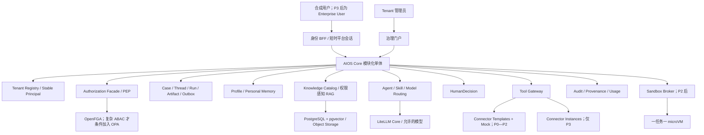

# 通用多企业 AI 员工平台：完备工程级方案 v5.0

日期：2026-07-26  
状态：待 Product Owner 作为新工程基线确认；不代表任何工作包已经完成  
输入基线：[37 个单项目 WBS、开源项目/标准与实践路径 v2.0](</Users/tristian/Documents/Codex/2026-07-24/gie/outputs/通用多企业AI员工平台_37个单项目WBS_开源项目标准与实践路径_v2.0.md>)  
输入基线 SHA-256：`c5a4ec1d8516b21cd61de132f56a96a18aa271d812e71cfb1adeadea4a70ef6b`  
取代范围：`通用多企业AI员工平台_完备工程级方案_v4.0` 的方案说明；历史文件保留  
规范优先级：本 v5.0 是上位工程规范；输入 WBS v2.0 保留详细选型资料，发生冲突时以本方案为准  
审批模型：外部 Product Owner 只审批 G0、G1、G2、G3 四个阶段门  

## 1. 执行结论

本项目工程上可实现，但它不是“安装一个开源聊天界面”就能达到的产品。真正需要交付的是：

> 一个以 Tenant、Stable Principal、服务端授权、权限感知知识、受治理 Skills、模型路由、HumanDecision、Tool Gateway、审计证据和短生命周期沙箱为共同底座的多企业 AI 员工平台。

正式基线拆成：

- **P0：4 个产品基础工作包**；
- **P1：19 个通用产品核心工作包**；
- **P2：6 个产品化与生产加固工作包**；
- **P3：8 个可重复执行的企业接入工作包模板**；
- 合计 **37 个工作包**，外加 **4 个阶段门**。

37 个工作包不等于 37 个微服务、37 个代码库、37 台服务器、37 名员工或 37 条审批链。P1 默认采用模块化单体和少量独立安全基础组件；只有隔离、容量、生命周期或运维证据要求不同，才拆成独立服务。

P0—P2 只允许 Synthetic Fixtures，不请求或使用企业内部资料、真实员工、生产凭据、企业内网地址或真实 Connector。P3 才由目标企业的授权接入人通过正式渠道提交企业接入包。Product Owner 不是目标企业员工，也不能用项目阶段审批代替企业的数据授权或业务操作授权。

## 2. 可实现度与真实难度

| 能力 | 可实现度 | 主要难点 | 判定 |
|---|---:|---|---|
| 多用户共享计算、每人逻辑独立 AI | 高 | Principal、状态归属、配额和并发 | 成熟工程能力 |
| 多企业 Tenant 隔离 | 高但要求严格 | 数据库、向量、文件、缓存、备份恢复全链路隔离 | 必须以负例和恢复后测试证明 |
| 企业知识与权限感知 RAG | 高 | ACL 必须在内容进入模型前生效 | 可实现，不能只靠 Prompt |
| Skills 和 Agent 工作流治理 | 高 | 版本、评测、发布、撤回和权限分离 | 可实现，首版应限制自由多 Agent |
| 多模型动态路由 | 高 | 数据级别、地区、权限先于质量和成本 | 可实现，模型不能决定权限 |
| 人工批准后受控执行 | 中高 | 完整对象哈希、幂等、回读、补偿 | 需要确定性工作流，不是聊天按钮 |
| 不可信代码沙箱 | 中高 | 独立内核、网络、密钥、销毁和供应链 | P2 专项建设，不放在应用服务器 |
| 可重复交付给多家企业 | 中高 | 配置化、Connector Template、安装升级和退出 | 必须拒绝为每家企业 Fork 核心 |
| 企业 OA/ERP/BI 接入 | 中等到高 | 取决于接口、授权、数据质量和厂商限制 | P3 逐系统、逐 Tenant 验收 |
| 企业级生产运行 | 中高 | SLO、HA、恢复、容量、安全运营 | 需要专门工程团队和持续运营 |

总体判断：

- **做出合成数据下的通用产品核心：可实现度高**；
- **做到可交付的生产候选：可实现度中高，但不能只靠一个非技术 Product Owner 单人完成全部工程**；
- **接入任一真实企业：技术可实现，进度取决于该企业的正式接口、授权主体和资料质量**；
- **高风险写回不是所有企业的必选项**，许多 Tenant 可以长期停在 C2 只读。

## 3. 不可变治理边界

### 3.1 数据时间边界

| Surface | 允许的数据 | 禁止的数据 |
|---|---|---|
| P0—P2 产品构建、验证、运行库和发布包 | 仅合成 Tenant、用户、知识、流程、指标和 Connector 响应 | 公开企业信息；真实或脱敏企业内部资料、员工、客户、订单、KPI、系统字段、凭据、内网地址、真实 Connector |
| 产品外独立 Public Context Registry | 有来源、日期、用途限制的公开外部信息 | 企业内部资料；将公开信息自动升级为内部事实 |
| P3 Tenant | 经目标企业授权、分级、限范围的接入资料 | 未授权资料；聊天中提交的密码、Token、私钥和连接串 |

公开企业信息必须标记为 `PUBLIC_EXTERNAL_CONTEXT`，保存来源、发布日期、采集日期和适用范围。它不能创建真实 Tenant 用户、权限、业务事实或 Connector Instance。

公开信息进入独立 Public Context Registry，每条至少保存：

```text
classification
source_url / publisher
published_at / collected_at
content_hash
allowed_purposes
```

它不得进入 Product Core 业务数据库、Synthetic Fixtures、评测真值、模型训练集或默认发行包。即使进入 P3，也必须由目标企业在 Onboarding Package 中重新确认后，才能作为该 Tenant 的内部知识输入。

### 3.2 三类权力严格分开

1. **Stage Approval**：Product Owner 对一个阶段冻结证据包作 `APPROVE / APPROVE_WITH_EXCLUSIONS / RETURN / HOLD`。
2. **Runtime Authorization**：目标企业授权一个 Tenant 的身份、数据、模型范围、Connector 能力和运行边界。
3. **HumanDecision**：P3 Tenant 内拥有真实业务权限的 Enterprise User（Human 类型 Tenant Principal）对一个冻结业务对象作运行时决定。

Product Owner 的阶段权不自动产生企业数据访问权、员工账号、系统操作权或 C3 写回批准权。

P1 只能用 Synthetic Tenant 和合成 Human Principal 生成 `SYNTHETIC_TEST_DECISION`，验证 HumanDecision 机制；它不能授权真实外部副作用，也不能被 P3 复用。

### 3.3 上级管理与个人空间

上级可在 Tenant 政策允许时管理部门 Skills、预算、配额、正式成果、已批准工作流和业务审计。默认不能读取员工私人会话或个人记忆。任何例外必须是 Tenant 级明确政策，并有单独版本、理由和审计。

### 3.4 企业系统仍是真相源

- OA/协同系统保存正式审批事实；
- ERP/业务系统保存订单、库存、交付等交易事实；
- BI 保存已认证指标和口径；
- AI 平台保存 Tenant 配置、映射、Case、Run、Artifact、EvidenceRef、HumanDecision 和审计；
- 个人记忆只保存用户确认的偏好和工作状态，不得覆盖企业正式事实。

## 4. 成功标准

项目成功不是“聊天能回答”，而是同时满足：

1. 一个产品包可创建至少三个合成 Tenant；
2. 不为员工分配独立 VPS，仍能保证会话、记忆、权限、配额和成本归属；
3. 数据库、向量、文件、搜索、缓存、日志和恢复结果的跨 Tenant 泄露为零；
4. 离职、停用和权限撤销能传播到会话、关系、缓存、Token、知识和工具；
5. 知识答案带来源、版本、页码或位置，证据不足时拒答；
6. 模型、Agent、Skill、MCP 和门户都不能绕过服务端授权；
7. 高风险动作绑定完整对象 SHA-256、HumanDecision、幂等执行和独立回读；
8. 任意代码只在短生命周期隔离沙箱运行；
9. 安装、升级、回滚、备份恢复和 Tenant 退出均有实际演练；
10. 接入第二家企业时不 Fork 产品核心。

## 5. 产品架构



### 5.1 推荐最小组合

P1 默认：

```text
LibreChat（可替换体验层）
+ 自建 AIOS Core 模块化单体
+ Keycloak
+ OpenFGA
+ PostgreSQL + pgvector
+ LangGraph
+ Docling / Tika
+ LiteLLM Core
+ Git / promptfoo
+ OpenTelemetry / Prometheus / Jaeger 最小链
```

P2 按验收需要增加：

```text
Kubernetes / Helm / Argo CD
+ OpenBao
+ Harbor / ORAS / Cosign / Syft / Trivy / Kyverno
+ Kata microVM；Firecracker 为强隔离替代
+ CloudNativePG / pgBackRest 或合格托管 PostgreSQL
+ Velero / 对象版本与恢复编排
+ k6 或 Locust / Argo Rollouts
```

P3 通常只增加 Tenant 配置、企业身份与组织投影、知识/Skill 包和 Connector Instances。若 T01 选择最高隔离档，可为该 Tenant 独立部署数据面或整套产品，但仍使用同一个 Product Core Release，禁止 Fork 企业专用代码。

## 6. 核心领域对象与信任边界

| 对象 | 含义 | 权威来源 | 关键约束 |
|---|---|---|---|
| Tenant | 一家目标企业的隔离边界 | Tenant Registry | 不等于 Keycloak Realm、Workspace 或 Namespace |
| Synthetic Tenant | P0—P2 的可丢弃虚构隔离边界 | Tenant Registry | `tenant_kind=SYNTHETIC` 不可改变，不得原地升级或复用到 P3 |
| Stable Principal | Tenant 内稳定的人/Agent/服务身份 | AIOS Core | 不能只用邮箱、姓名或工号 |
| Case | 一个有目标、证据和状态的工作事项 | AIOS Core | 不等于自由聊天 |
| Run | 一次可重放执行 | AIOS Core | 记录版本、路由、Tool 和副作用 |
| Artifact | AI 或流程生成的版本化成果 | AIOS Core | 高风险执行前必须冻结 |
| EvidenceRef | 对知识、指标或系统结果的来源引用 | 知识目录或受控 Tool | 带版本、新鲜度和访问上下文 |
| Skill Release | 通过评测和发布门的工作方法版本 | Skills Registry | Prompt 声明不能替代权限 |
| HumanDecision | 企业真人对冻结 Artifact 的生产有效业务决定 | AIOS Core | 仅 Human 类型 Enterprise User；绑定哈希；对象变化即失效 |
| Synthetic Test Decision | P1 验证 HumanDecision 机制的合成决定 | AIOS Core | 禁止真实副作用，不可带入 P3 |
| Connector Template | 无企业地址和凭据的通用适配契约 | 产品核心 | P0—P2 只能 Template + Mock |
| Connector Instance | 一个 Tenant 的真实连接实例 | P3 Onboarding | 从 C0 开始按需逐级升级；禁止跳级；C3 非必选，T06 禁止 C3 |
| AuditEvent | 不可覆盖的业务证据事件 | Audit Store | 与普通 Trace/Log 分开 |

所有客户端提交的 `tenant_id`、`principal_id`、角色、组、Tool 参数和资源 ID 都是不可信输入。服务端必须从已验证会话重建 Tenant 和 Principal，再执行授权。

## 7. 阶段、工作包和阶段门

| 阶段 | 工作包 | 阶段目标 | 阶段门 |
|---|---:|---|---|
| P0 | F01—F04，共 4 项 | 冻结产品边界、合成数据、契约和安全评测基线 | G0 |
| P1 | C01—C19，共 19 项 | 完成合成环境下的通用多租户产品核心 | G1 |
| P2 | O01—O06，共 6 项 | 完成沙箱、密钥、供应链、部署、恢复和发布工程 | G2 |
| P3 | T01—T08，共 8 项模板 | 为一个目标企业实例化 Tenant 并完成真实试点 | G3 |

阶段门不计入 37 项。每个阶段门只接受冻结证据包，不接受口头说明、可变目录或“测试过了”的截图作为唯一证据。

## 8. 责任能力、工作量和人员口径

### 8.1 责任不是新增审批链

每个工作包指定一个唯一负责角色，只表示谁对交付结果负责。一人可以承担多个角色；Product Owner 可以委派产品侧执行，但看板只记录 Product Owner 的阶段审批结果。

P3 的企业授权接入人、系统接口负责人和业务 HumanDecision 主体属于目标企业运行授权边界，不是本项目新增的阶段审批人。

### 8.2 工作量等级

| 等级 | 粗略净工程量 | 用途 |
|---|---:|---|
| S | 1—2 人周 | 小型契约、固定范围适配或单项验证 |
| M | 3—6 人周 | 一个清晰模块和完整测试 |
| L | 7—12 人周 | 跨模块能力、安全验证或复杂集成 |
| XL | 13—20+ 人周 | 核心安全边界、平台运行时或生产加固 |

这是规划范围，不是工期承诺；不包含招聘、采购、企业等待、法务、网络开通和外部系统整改。多个工作包可以在依赖满足后并行。

### 8.3 建议团队形态

| 目标 | 建议人类工程能力 | 说明 |
|---|---|---|
| P0 | 2—4 个能力角色 | 产品架构、API/数据、QA/安全；可由少数人兼任 |
| P1 | 6—10 人的跨职能产品小组 | 后端/平台 2—3、前端 1、IAM/安全 1、AI/知识 1—2、QA/SRE 1—2 |
| P2 | 6—10 人，平台安全与 SRE 比重提高 | 沙箱、Kubernetes、供应链、数据库恢复和性能必须有人负责 |
| P3 每个 Tenant | 产品侧 3—5 人，加目标企业授权接口 | 只在 P3 需要企业身份、知识、源系统和业务试点配合 |

如果只有 Product Owner 一名人类负责，应把自己定位为方向、范围和阶段审批者，使用外部工程人员、供应商或后续招聘承担实现与独立验证。AI 可以显著加速文档、代码和测试，但不能替代企业授权、基础设施控制权、渗透验证和生产值守。

## 9. P0：4 个产品基础工作包

P0 目标是把图纸、材料标准、合成试验场和放行规则做成可执行门禁。P0 不正式实现 P1 模块；只允许为验证契约而写可丢弃 Spike。

### F01 产品领域模型与阶段治理

- **结果**：所有人使用同一套产品术语、对象、阶段、证据和审批语义。
- **范围**：`CONTEXT.md`、ADR、37 项边界、G0—G3、证据包 Schema、规范化与哈希规则、决策事件。
- **不做**：不实现 Tenant、身份、门户或企业流程；不把部门审批放入产品阶段看板。
- **依赖**：无；是全部工作包的根依赖。
- **默认方法**：Git + Markdown ADR；OpenAPI 3.1.x、JSON Schema 2020-12、CloudEvents、RFC 8785、W3C PROV、NIST AI RMF。
- **交付证据**：领域词典、ADR 集、37 项登记册、阶段门 Schema、冻结包生成与校验程序、四类 Product Owner 决策样例。
- **验收**：Stage Approval、Runtime Authorization、HumanDecision 无混用；阶段入口/出口可机器检查；同一冻结包产生稳定 SHA-256。
- **责任/规模**：产品架构负责人，M。

### F02 Synthetic Fixture Factory 与零企业数据门

- **结果**：平台可以在完全没有企业内部资料时持续开发和测试。
- **范围**：三个固定种子的虚构 Tenant；合成用户、组织、知识、权限、流程、指标和 Connector 响应；`SYNTHETIC` 水印；对 Product Core、Fixtures、评测真值、运行库和发布包等受保护 Surface 执行秘密、来源和企业标识门。
- **不做**：不使用“脱敏真实数据”生成样本；秘密扫描通过不等于自动证明无企业信息。
- **依赖**：F01。
- **默认方法**：Faker、factory_boy、Hypothesis、Gitleaks、JSON Schema；受保护 Surface 做多点阻断，独立 Public Context Registry 做来源完整性和未进入产品包的 Containment 检查。
- **交付证据**：Schema、生成器、固定种子、数据清单、受保护 Surface 清单、负例样本、扫描规则、Public Context Containment 和 CI 阻断报告。
- **验收**：三个 Tenant 可重复生成；每次生成关系一致；受保护 Surface 中的真实企业标识、凭据和未水印数据会被阻断；合法 Public Context 只能存在于独立 Registry 且不被打包。
- **责任/规模**：测试数据与 QA 负责人，M。

### F03 API、事件、Schema 与兼容实验室

- **结果**：先冻结模块之间的“插头”，再独立建设模块，避免接口靠口头约定。
- **范围**：Canonical Schema、Portal/Core/Model/Tool/Connector/Audit 的 OpenAPI 和事件外壳、错误格式、Mock Server、契约测试、兼容矩阵、废弃策略。
- **不做**：Schema 合法不表示已授权；Mock 成功不表示真实企业接入成功。
- **依赖**：F01、F02。
- **默认方法**：OpenAPI 3.1.2、JSON Schema、CloudEvents、RFC 9457、Pact、WireMock、Schemathesis、Testcontainers。
- **交付证据**：版本化契约、生成样例、Mock、消费者/提供者测试、破坏性变更检查、兼容和废弃矩阵。
- **验收**：不兼容变更被 CI 阻断；错误不泄露堆栈或秘密；各模块可以只依赖契约进行合成集成测试。
- **责任/规模**：API/契约负责人，L。

### F04 威胁模型、质量评测与发布门基线

- **结果**：把“什么绝不能发生”和“怎样证明没发生”变成可重复测试。
- **范围**：资产、信任边界、滥用案例；正常、拒绝、越权、注入、审批绕过、资源滥用测试；人工答案集；发布阈值。
- **不做**：自动 LLM Judge 不替代人工基线；高平均分不能抵消一次跨 Tenant 泄露。
- **依赖**：F01—F03。
- **默认方法**：OWASP Threat Dragon、promptfoo、garak；参考 OWASP LLM Top 10、MITRE ATLAS、NIST AI RMF。
- **交付证据**：Threat Model、冻结测试集、人工标注集、零容忍清单、发布门配置、失败报告样例。
- **验收**：跨 Tenant、越权、审批绕过和 P0—P2 企业数据提前进入均为零容忍；评测可在固定版本上重复。
- **责任/规模**：AI 安全与评测负责人，L。

### G0：P0 → P1

同时满足才可提交 Product Owner：

1. F01—F04 全部达到各自 Definition of Done；
2. 37 项 WBS、依赖、领域词汇、契约、威胁模型和 No-Go 已冻结；
3. F02 可生成三个合成 Tenant，但尚未把它们冒充 P1 已部署结果；
4. P0—P2 零企业内部数据门可自动阻断；
5. P0 证据包被规范化并产生真实 SHA-256；
6. Product Owner 对准确哈希作 `APPROVE`，或作通过全部必选门条件的 `APPROVE_WITH_EXCLUSIONS`；`RETURN/HOLD` 不开放 P1。

## 10. P1：19 个通用产品核心工作包

P1 使用三个合成 Tenant 完成产品核心。根级顺序是：

```text
C03 → C04/C05 → C06 → C07 → C08
→ C09/C10/C11/C13/C14/C18 并行
→ C15/C16/C17
→ C12/C19
→ C01/C02
→ 三 Tenant 端到端验收
```

### C01 最终用户 AI 门户与身份 BFF

- **结果**：提供登录、聊天、文件、引用、Agent/Skill 目录、记忆和审批体验，同时保持门户可替换。
- **范围**：门户适配器、短时平台会话、文件隔离上传、流式响应、可访问性和端到端体验。
- **不做**：门户不直连模型、知识库或 Connector；LibreChat 数据库不保存授权、HumanDecision 或审计真相。
- **依赖**：C03—C06、C08、C14—C16。
- **默认方法**：LibreChat + 薄 BFF；assistant-ui 作为最小替换契约验证；OIDC、SSE、WCAG。
- **交付证据**：Portal/Core 契约、固定上游版本、跨用户拒绝测试、替换门户测试、上传安全测试。
- **验收**：绕过 UI 直接调 API 仍被拒绝；替换最小门户不迁移权限和审批真相；P1 只使用合成用户。
- **责任/规模**：员工体验与前端负责人，L。

### C02 Tenant 管理与治理门户

- **结果**：Tenant 管理者只看到并管理被服务端允许的配置、正式成果和治理信息。
- **范围**：Tenant 配置、用户/角色投影视图、知识和 Skill 发布、配额、审计只读、Connector 状态。
- **不做**：UI 隐藏不作为权限；默认不展示私人会话和个人记忆。
- **依赖**：C03—C07、C13、C18、C19。
- **默认方法**：Next.js + react-admin 或等价薄管理页，全部调用 AIOS Core API。
- **交付证据**：管理 API、权限矩阵、直接 API 越权测试、私人数据拒绝测试、变更审计。
- **验收**：所有管理写操作服务端重鉴权；业务管理员不能修改历史审计；高风险变更需要完整证据。
- **责任/规模**：管理产品/前端负责人，L。

### C03 Tenant Registry 与生命周期

- **结果**：幂等地创建、暂停、恢复、删除和对账一个产品 Tenant。
- **范围**：Tenant Schema、不可变 `tenant_kind=SYNTHETIC|ENTERPRISE`、分离的创建命令与 ID Namespace、状态机、配置引用、Provisioning Outbox、Reconciler、分层删除。
- **不做**：Registry 不保存企业正文和密钥；Tenant 不等于 Realm、Organization 或 Namespace。
- **依赖**：F01—F03。
- **默认方法**：AIOS Core 内薄控制面 + PostgreSQL；UUIDv7、CloudEvents、事务 Outbox。
- **交付证据**：Tenant API、迁移、状态机、幂等和并发测试、暂停/恢复/删除演练、投影对账。
- **验收**：重复请求不重复建 Tenant；失败不误进入 ACTIVE；暂停后所有新请求拒绝；任何 `tenant_kind` 变化及 Synthetic ID、身份、知识、密钥或存储复用到 P3 都被拒绝；删除可跟踪传播。
- **责任/规模**：Tenant 控制面负责人，M。

### C04 身份联邦、SSO 与 Provisioning

- **结果**：严格认证合成用户，并可靠处理入职、调岗、离职和会话撤销。
- **范围**：OIDC/SAML Broker、MFA、合成 SCIM/Admin Adapter、身份投影、乱序和重放处理。
- **不做**：身份认证不等于业务授权；P1 不连接真实企业 IdP。
- **依赖**：C03。
- **默认方法**：Keycloak；ZITADEL 为替代；复杂多源 IGA 经触发条件再用 Apache Syncope；OIDC、RFC 9700、SCIM。
- **交付证据**：OIDC/SCIM 兼容报告、严格 issuer/audience/redirect 测试、入调离和密钥轮换记录。
- **验收**：乱序事件不能恢复离职账号；会话和下游关系按冻结目标撤销；同名或同邮箱不自动合并。
- **责任/规模**：IAM/SSO 负责人，L。

### C05 Stable Principal 与委托链

- **结果**：建立不依赖邮箱或显示名的稳定身份，并区分人、Agent 和服务的行动链。
- **范围**：`principal_id`、IdentityLink、Human/Agent/Service 类型、subject、actor、delegation、停用传播。
- **不做**：邮箱、姓名、工号或门户用户 ID 不作为长期安全主键。
- **依赖**：C03、C04。
- **默认方法**：AIOS Core 小模块 + PostgreSQL；UUIDv7；需要时使用 RFC 8693 Token Exchange。
- **交付证据**：Principal Schema、唯一约束、换邮箱/IdP、碰撞、关联/拆分、委托和停用测试。
- **验收**：外部身份变化时内部 ID 不变；同邮箱不自动合并；每次动作同时追溯主体与执行 Actor。
- **责任/规模**：身份数据负责人，M。

### C06 统一授权策略与 PEP SDK

- **结果**：每个读取、检索、下载、管理、Tool 和 Sandbox 路径都执行一致的服务端授权。
- **范围**：Authorization Facade、关系模型、PEP SDK、决策日志、模型发布/回放/回滚、故障关闭。
- **不做**：Prompt、门户 ACL、MCP 声明和 Skill `allowed-tools` 都不作为授权真相。
- **依赖**：C03、C05。
- **默认方法**：OpenFGA；SpiceDB 为替代；复杂 ABAC 有证据时才加 OPA；AuthZEN 作为接口外形。
- **交付证据**：50—100 条 Allow/Deny Fixture、授权模型、PEP 覆盖表、决策回放、模型迁移和故障测试。
- **验收**：所有资源路径纳入 PEP；固定 `authorization_model_id`；PDP 故障时高敏路径失败关闭；权限变化及时生效。
- **责任/规模**：授权策略负责人，XL。

### C07 Tenant 数据隔离与生命周期

- **结果**：数据库、向量、对象、搜索、缓存、连接池和恢复副本都不能跨 Tenant 泄露。
- **范围**：`tenant_id` 约束、PostgreSQL RLS、向量过滤、对象前缀/策略、缓存键、删除传播和恢复复测。
- **不做**：Namespace、数据库字段或客户端 Filter 单独都不构成完整隔离。
- **依赖**：C03、C06。
- **默认方法**：PostgreSQL `FORCE RLS` + pgvector；容量触发后才评估 Qdrant/OpenSearch。
- **交付证据**：RLS Policy、Owner/BYPASSRLS 检查、连接池污染测试、全存储越权矩阵、恢复后复测。
- **验收**：任何存储路径的跨 Tenant 泄露为零；缓存命中后仍重鉴权；删除和停用传播可验证。
- **责任/规模**：多租户数据安全负责人，XL。

### C08 AIOS 状态核心

- **结果**：每个工作事项和副作用都有可重放、可对账的状态真相。
- **范围**：Case、Thread、Run、Artifact、ToolCall、Outbox、幂等键、版本、状态机和补偿引用。
- **不做**：不复制 ERP、BI、OA 正式事实；不把自由聊天记录当流程状态。
- **依赖**：C03、C05—C07、F03。
- **默认方法**：FastAPI/Pydantic/SQLAlchemy/Alembic + PostgreSQL 的模块化单体；CloudEvents、RFC 8785。
- **交付证据**：Domain Schema、迁移、状态机、Outbox、崩溃重放、并发和重复提交测试。
- **验收**：一次 Run 可还原输入、模型、Prompt、Skill、知识、Tool、策略和结果版本；重试不重复副作用。
- **责任/规模**：AIOS Core 负责人，XL。

### C09 个人 Profile、会话与记忆

- **结果**：为每个 Principal 保存可解释、可确认、可纠正和可删除的个人状态。
- **范围**：Profile、Checkpoint、Candidate/Confirmed/Expired/Deleted MemoryEvent、同意、纠正、暂停和删除。
- **不做**：模型不能直接写生效记忆；价格、订单、合同、认证和 KPI 不进入个人记忆。
- **依赖**：C05—C08。
- **默认方法**：PostgreSQL + LangGraph Checkpointer；Mem0 只作候选增强；Graphiti 仅经 P2 对照评测后考虑。
- **交付证据**：MemoryEvent Schema、同意/删除 UI、注入和跨用户测试、备份保留/过期验证。
- **验收**：只有本人确认的候选记忆生效；召回先过滤 Tenant、Principal、状态和过期；删除传播可证明。
- **责任/规模**：个人数据与记忆负责人，L。

### C10 知识摄取、解析与目录

- **结果**：每份可检索资料都有来源、版本、有效期、密级、ACL 和从原件到 Chunk 的来源链。
- **范围**：隔离上传、哈希、病毒/宏/隐藏内容检查、解析/OCR、目录、发布、撤回和删除。
- **不做**：未编目的文件不发布；解析器输出不自动成为权威知识。
- **依赖**：C03、C06—C08。
- **默认方法**：Docling + Apache Tika 兜底；PostgreSQL 目录；JSON Schema、W3C PROV。
- **交付证据**：冻结文档基准集、解析质量报告、Knowledge Catalog、来源链、恶意文件和撤回测试。
- **验收**：缺少 Owner、来源、版本、有效期、密级或 ACL 的资料不能发布；页、节、表坐标可追溯。
- **责任/规模**：知识工程负责人，L。

### C11 权限感知检索与 RAG

- **结果**：只在当前 Principal 被允许的知识集合中检索、重排和生成带证据的答案。
- **范围**：授权前置过滤、全文/向量混合检索、重排、EvidenceRef、拒答、撤回和删除失效。
- **不做**：不先检索再用 Prompt 过滤；向量数据库 Filter 不由客户端或模型决定。
- **依赖**：C06、C07、C10。
- **默认方法**：PostgreSQL FTS + pgvector；只有冻结基准不达标才升级 Qdrant/OpenSearch。
- **交付证据**：ACL 前置证明、召回/引用指标、版本与 as-of 测试、跨 Tenant 负例和删除传播。
- **验收**：草稿、过期、撤回和未授权资料不进入模型上下文；回答返回正确来源位置；证据不足拒答。
- **责任/规模**：搜索/RAG 负责人，XL。

### C12 Agent 编排与任务路由

- **结果**：用显式状态图完成分类、知识/工具、草稿、校验、复核和人工门。
- **范围**：TaskEnvelope、节点 Schema、Checkpoint、权限/风险/预算硬过滤、独立复核和错误控制。
- **不做**：首版不使用自由聊天式 Agent 群；模型不决定权限、上云、预算或是否需要批准。
- **依赖**：C06、C08、C11、C14、C16。
- **默认方法**：LangGraph；按团队栈二选一评估 PydanticAI、Semantic Kernel 或 Haystack；MCP 仅作互操作门面。
- **交付证据**：状态图、节点 I/O、路由理由、故障恢复、预算、拒绝和 Tool 权限测试。
- **验收**：每个节点和调用版本可解释；Checkpoint 与业务审计分离；失败不会绕过人工门或重复副作用。
- **责任/规模**：Agent 运行时负责人，XL。

### C13 Skills Registry、测试、发布与回滚

- **结果**：Skill 从提交到撤回全程版本化、评测、审批和可回滚。
- **范围**：兼容的 Agent Skills 子集、Git PR/CODEOWNERS、Manifest、静态检查、评测、SHA-256、pilot/stable、撤回。
- **不做**：P1 不执行任意 Skill 脚本；`allowed-tools` 不授予业务权限；未测试/未批准 Skill 不运行。
- **依赖**：C06、C08、F04。
- **默认方法**：P1 使用 Agent Skills + Git + promptfoo + SHA-256；P2 的 OCI、SBOM、签名与准入完全归 O03，C13 不形成反向依赖。
- **交付证据**：Skill Manifest、评测、内容哈希、发布范围、灰度、撤回和回滚报告。
- **验收**：P1 运行绑定不可变内容哈希；撤回后新 Run 不可解析该版本；任意 Skill 脚本保持关闭。
- **责任/规模**：Skill 发布负责人，L。

### C14 模型网关、路由与本地推理

- **结果**：只在政策允许的模型集合中，按质量、成本和延迟进行可解释路由。
- **范围**：Model Registry、统一请求/响应/Usage/Error、数据和地区硬过滤、限额、Fallback、成本回账。
- **不做**：模型和 Virtual Key 不代表员工权限；敏感任务不能静默改发云端。
- **依赖**：C03、C06、C08。
- **默认方法**：LiteLLM Core；有本地 GPU 才加 vLLM；Envoy AI Gateway 只在 P2 性能数据触发后评估。
- **交付证据**：模型目录、Provider 契约、路由决策、Fallback 负例、实际用量和成本对账、Canary。
- **验收**：先做授权、数据分类、地区和云/本地硬过滤，再比较模型；Fallback 不突破允许集合。
- **责任/规模**：模型平台负责人，L。

### C15 HumanDecision 与可靠工作流

- **结果**：建立完整对象、差异、哈希、决定、幂等执行和回读机制；P1 只产生 Synthetic Test Decision。
- **范围**：DraftArtifact、确定性校验、RFC 8785、SHA-256、差异/来源/风险展示、Outbox、幂等、回读和补偿。
- **不做**：聊天中的“同意”、LangGraph Interrupt 或普通按钮点击本身不构成决定；P1 合成决定不产生真实外部副作用；Stage Approval 不替代 P3 HumanDecision。
- **依赖**：C06、C08、C18。
- **默认方法**：P1 PostgreSQL 状态机/Outbox；跨天等待、复杂回调和补偿显著时才升级 Temporal；明确 BPMN 需求才选 Flowable。
- **交付证据**：HumanDecision/Synthetic Test Decision Schema、审批展示、篡改/过期/撤权、重复提交、回读不一致和补偿测试。
- **验收**：任一受批字段、收件人、附件、规则、Skill 或相关版本改变都使旧决定失效；P1 真实外部执行为零；Synthetic Test Decision 不可迁移到 P3。
- **责任/规模**：工作流与 HumanDecision 负责人，XL。

### C16 Tool Gateway 与每次调用重鉴权

- **结果**：Agent 只调用有明确名称、Schema、用途、权限和审计的窄业务操作。
- **范围**：Tool Catalog、`operation_id`、PEP、参数白名单、限流、短期凭据、Adapter、错误规范和审计。
- **不做**：不提供任意 SQL、任意 URL、万能管理员 Tool、长期生产账号；MCP 保护不等于业务授权。
- **依赖**：C05、C06、C14、C18。
- **默认方法**：自建窄接口 Gateway；Envoy/Kong 作通用 API 层；MCP/OpenAPI 由同一业务契约生成或校验。
- **交付证据**：Operation Catalog、权限负例、参数和错误测试、凭据生命周期、调用审计和无万能接口证明。
- **验收**：Tool 发现、参数确认和执行各阶段均使用可信主体重鉴权；凭据不进入模型上下文。
- **责任/规模**：Tool Gateway 负责人，XL。

### C17 Connector Template SDK 与 Mock Lab

- **结果**：建立审批协同、ERP/业务和 BI 三类厂商无关连接模板及完整模拟实验室。
- **范围**：Adapter SPI、Canonical Envelope、Template、Mock、兼容、安全测试、SDK 和校验器。
- **不做**：P0—P2 不出现真实企业地址、凭据、网络、字段映射或 Connector Instance。
- **依赖**：F03、F04、C16。
- **默认方法**：薄 Adapter + Pact/WireMock/Testcontainers；只有真实遗留协议复杂度触发后才引入 Apache Camel。
- **交付证据**：三类 Template/Mock/SDK、兼容矩阵、SSRF/凭据泄露/Tenant 混淆/授权绕过/Schema 注入/重放/超时测试。
- **验收**：所有攻击和失败关闭测试通过；Mock 不被标为企业已接入；仓库和运行环境无企业端点与凭据。
- **责任/规模**：Connector SDK 负责人，L。

### C18 审计、证据与来源链

- **结果**：身份、授权、模型、知识、Skill、Tool、决定和结果能串成不可覆盖、可恢复的业务证据。
- **范围**：AuditEvent、事务 Outbox、规范化哈希链、受限追加存储、W3C PROV、保留、查询和恢复。
- **不做**：Git、应用日志、OpenTelemetry 和数据库备份都不单独等于业务审计；默认不保存正文。
- **依赖**：C03、C05、C08、F03。
- **默认方法**：P1 PostgreSQL/Outbox + RFC 8785 + W3C PROV；P2 的检查点签名、密钥轮换与恢复归 O02/G2，不重新打开 C18。
- **交付证据**：事件 Schema、哈希链、管理员不可覆盖测试、独立保留与恢复。
- **验收**：业务管理员不能更新或删除历史事件；恢复后链条完整；正文最小化；篡改可检测。
- **责任/规模**：审计与证据负责人，XL。

### C19 可观测、用量、配额与成本

- **结果**：产品运行性能、故障、用量、配额和成本可跨模块追踪与对账。
- **范围**：Trace/Metric/Log、SLI、Usage Ledger、费率版本、Tenant/Principal 配额和告警。
- **不做**：产品运行可观测不替代项目实施进度看板；默认不记录 Prompt、文件或 Tool 正文。
- **依赖**：C03、C14、C16、C18。
- **默认方法**：OpenTelemetry + Prometheus + Jaeger + Grafana；P1 用 PostgreSQL 账本，规模触发后再评估 OpenMeter/OpenCost。
- **交付证据**：端到端 Trace、低基数指标、SLO 草案、去重计量、供应商和基础设施成本差异报告。
- **验收**：一次请求可跨模块关联；费用按 Tenant/任务/模型/Tool/沙箱对账；日志不泄露敏感正文。
- **责任/规模**：SRE/FinOps 负责人，L。

### G1：P1 → P2

同时满足：

1. C01—C19 的冻结 P1 范围全部验收；
2. F02 的三个合成 Tenant 已真正部署，每个包含多用户和多角色；
3. SQL、向量、文件、对象、搜索、缓存、Tool 和恢复副本的跨 Tenant/用户/角色泄露为零；
4. “登录 → Agent → RAG/Tool → Synthetic Test Decision → 审计/用量”可以完整重放，且无真实外部副作用；
5. 任意代码执行仍关闭，Connector 仍为 Template + Mock/C0；
6. P1 冻结包哈希由 Product Owner 批准。

## 11. P2：6 个产品化与生产加固工作包

本方案选择“可重复交付的企业生产候选”作为 G2 标准，因此 Kubernetes/Helm/GitOps、短生命周期 microVM、签名供应链、实际恢复和长稳测试属于 G2 正式范围。开发演示可以使用 Compose，但不能以此证明生产就绪。

### O01 Sandbox Broker 与隔离执行

- **结果**：不可信代码或插件任务在一任务一实例的短生命周期 microVM 中执行。
- **范围**：Broker API、模板、专用节点、调度、输入暂存、默认拒绝出口、资源限制、短时身份、输出扫描、Reaper 和销毁证据。
- **不做**：普通容器或 gVisor 不冒充 microVM；沙箱不承担订单、合同、报价或审批等正式写回。
- **依赖**：C03、C05—C08、C16、C18、O02、O03。
- **默认方法**：Kata Containers；Firecracker 为更强隔离替代；gVisor 只用于固定解析和中低风险任务；PSS、Seccomp、RuntimeClass。
- **交付证据**：启动/销毁、逃逸、横移、默认出口、DoS、残留、节点失联、超时和 Kill Switch 测试。
- **验收**：每任务新实例；无宿主机、Docker Socket、长期密钥和默认网络；输出经过扫描；任务后状态不可恢复。
- **责任/规模**：沙箱与运行时安全负责人，XL。

### O02 密钥、短期凭据与工作负载身份

- **结果**：服务和沙箱只在需要时获得短期、限定范围的凭据，并可轮换、撤销和恢复。
- **范围**：Secret Manager、动态凭据、租约、ServiceAccount、CSI、审计检查点签名密钥、轮换、Break-glass、恢复。
- **不做**：工作负载身份不等于 Enterprise User；Root Token 和长期秘密不进入应用。
- **依赖**：C03、C05、C06。
- **默认方法**：OpenBao + Kubernetes 短期 ServiceAccount + CSI；跨集群/VM/裸机需求出现后才引入 SPIRE。
- **交付证据**：Secret Policy、跨 Tenant/服务/环境拒绝、审计检查点签名/验证、轮换、泄露撤销、OpenBao HA/Unseal/恢复和 Break-glass 演练。
- **验收**：秘密不进入 Git、镜像、Prompt、日志或文档；短期凭据过期和撤销有效；签名检查点在轮换和恢复后仍可验证；恢复后策略一致。
- **责任/规模**：密钥与工作负载身份负责人，L。

### O03 软件供应链与制品信任

- **结果**：只有来源清楚、版本固定、经过扫描、签名和准入的镜像与 Skill 制品可以运行。
- **范围**：依赖锁、OCI、SBOM、漏洞扫描、Provenance/Attestation、签名、准入、例外到期和紧急撤回。
- **不做**：签名不证明业务正确或内容安全；SBOM、漏洞扫描、来源和批准不能互相替代。
- **依赖**：F03、C13、C17、O02。
- **默认方法**：Harbor/ORAS + Cosign + Syft/Trivy + Kyverno；SLSA、in-toto、CycloneDX，SPDX 按需导出。
- **交付证据**：Release Manifest、Digest、SBOM、漏洞报告、Provenance、签名、准入和撤回演练。
- **验收**：未固定 Digest、未签名或缺必要材料的制品被阻断；许可证和来源可追溯；例外自动到期。
- **责任/规模**：软件供应链安全负责人，L。

### O04 可重复打包、部署、升级与回滚

- **结果**：从空环境安装企业无关产品，并可靠升级、回滚和初始化新 Tenant。
- **范围**：Compose 开发包、Helm Chart、环境配置、数据库迁移、Tenant 初始化、GitOps、兼容矩阵和回滚。
- **不做**：Compose 不作为 HA 证明；安装包不带企业资料、名称、账号、端点、凭据或 Connector Instance。
- **依赖**：C01—C19、O02、O03。
- **默认方法**：Docker Compose（开发）+ Kubernetes/Helm/Argo CD（生产）；多环境重复建设触发后再使用 OpenTofu。
- **交付证据**：空环境安装、重复安装、前后兼容迁移、升级、回滚、Tenant 初始化和企业数据/Secret 扫描。
- **验收**：同一 Release Manifest 可复现；失败升级自动或受控回退；回退后数据、权限和审计一致。
- **责任/规模**：平台交付/GitOps 负责人，XL。

### O05 高可用、备份、恢复与灾备

- **结果**：数据库、对象、制品、配置和必要密钥材料可以在隔离环境实际恢复，并达到冻结 RPO/RTO。
- **范围**：PostgreSQL HA/PITR、对象版本与复制、Registry/Git/Kubernetes 恢复、删除标记、灾备演练。
- **不做**：备份任务成功不等于恢复成功；Velero 或数据库副本不单独等于完整灾备。
- **依赖**：O04、C03、C07、C18。
- **默认方法**：CloudNativePG + pgBackRest 或合格托管 PostgreSQL；Velero；对象存储原生版本/复制。
- **交付证据**：随机恢复点、全栈恢复报告、实测 RTO/RPO、恢复后权限/隔离/审计/签名复测。
- **验收**：业务数据、审计和配置达到一致性目标；恢复后无跨 Tenant 泄露；删除与保留策略仍成立。
- **责任/规模**：数据库与灾备负责人，XL。

### O06 SLO、容量、压测、混沌与发布工程

- **结果**：按真实峰值并发和工作负载画像定容，并证明长稳、故障恢复、Canary 和自动回滚。
- **范围**：`capacity-profile`、SLI/SLO、错误预算、峰值、长稳、依赖故障、Schema 兼容、Canary、自动中止和成本账本。
- **不做**：不按员工总人数直接定容；不因工期紧张随意缩短长稳；合成负载不冒充真实 P3 观察。
- **依赖**：C01—C19、O01、O04、O05、F04。
- **默认方法**：k6 或 Locust + OpenTelemetry/Prometheus + Argo Rollouts；基础故障测试成熟后才引入 Chaos Mesh。
- **交付证据**：冻结 capacity profile 及哈希、2 倍目标峰值 60 分钟、目标持续负载 72 小时原始结果、故障矩阵、Canary 和回滚报告。
- **验收**：延迟、可用性和错误预算达标；异常会自动停止发布；只有等价或更高负载、总请求量不减少、最短 24 小时且 Product Owner 明确接受剩余风险时才可书面缩短。
- **责任/规模**：性能与发布工程负责人，XL。

### G2：P2 → P3

同时满足：

1. O01—O06 全部达到冻结范围；
2. 固定 Release Digest 上重跑 F02、F04、C01—C19 和 C17 的关键回归，P0/P1 不回退；
3. 产品可从空环境重复安装、升级和回滚；
4. 未签名、缺必要 SBOM/Provenance 或未通过准入的制品被阻断；
5. Kata 或 Firecracker microVM、默认断网、销毁和资源隔离通过；
6. 审计周期检查点签名、验证、密钥轮换和恢复通过；
7. 峰值、长稳、SLO、错误预算、Canary、自动回滚、PITR 和灾备达到冻结标准；
8. Connector Template 安全矩阵在发布候选上通过；
9. 默认安装包不含任何企业名称、用户、资料、地址、凭据或 Connector Instance；
10. P2 冻结产品包哈希由 Product Owner 批准。

## 12. P3：8 个可重复企业接入工作包模板

P3 是首次允许企业内部信息进入的阶段，但不是“一次性把所有资料灌进系统”。每个 Tenant 按 T01→T08 分批、最小化、授权、验证和可撤回地接入。

F01—O06 的产品建设负责人可由 Product Owner 或产品交付组织指定。T01—T08 中企业侧身份管理员、知识 Owner、源系统接口负责人、C3 运行授权主体和正式动作批准人，必须由 Target Enterprise 正式指定；Product Owner 只审批阶段包并记录必要授权引用。

### Tenant Isolation Profile

T01 必须为每个真实 Tenant 选择并验证一个隔离档：

| 档位 | 计算 | 数据库/向量 | 对象/密钥/备份 | 部署 |
|---|---|---|---|---|
| I1 逻辑强隔离 | 共享 Worker | 共享集群，`FORCE RLS` 和 Tenant 约束 | 独立前缀、策略、密钥 Namespace 和恢复验证 | 共享产品部署 |
| I2 独立数据隔离 | 共享 Worker 或专用池 | 独立数据库/索引 | 独立对象空间、密钥和备份链 | 共享控制面，可独立数据面 |
| I3 独立部署隔离 | 专用计算 | 独立数据库/索引 | 独立对象、密钥、备份和恢复域 | 使用同一 Product Core Release 的独立部署 |

隔离档由目标企业 Runtime Authorization 和风险基线决定。降级必须形成新 Data Policy Pack、授权引用、迁移/回滚计划和完整复测；任何档位都不能 Fork Product Core。

### T01 企业接入控制、Tenant 创建与 Data Policy Pack

- **结果**：在核验目标企业授权后，为其创建全新的真实 Tenant 和数据政策；Synthetic Tenant 不原地升级。
- **范围**：授权引用、Onboarding Package、RFC 8785/SHA-256、`tenant_kind=ENTERPRISE` 的全新 Tenant、Isolation Profile、数据分级、模型/地区、隐私、保留/删除、审计、备份和配额。
- **不做**：Product Owner 不能替代企业授权接入人；密码、Token、私钥和连接串不进入聊天、文档或接入包。
- **入口**：G2 已通过；目标企业已选定；Enterprise Authorized Onboarding Principal 可验证；最小 Data Policy Pack 已提交。
- **默认方法**：复用 C03、C07、C14、C15、C18、O04—O06；秘密只保存引用，由授权人员写入密钥系统。
- **交付证据**：授权引用、接入包哈希、Tenant/Data Policy、允许/拒绝/删除/恢复测试、创建对账和无明文秘密证明。
- **验收**：所有投影一致；Isolation Profile 的数据库、对象、密钥、计算、备份和部署边界通过正反例；公开资料不自动升级为内部事实；无 Synthetic ID/身份/知识/密钥/存储复用；Tenant 可停用和删除。
- **责任/规模**：产品侧 Onboarding 负责人 + 企业授权接入人，L。

### T02 身份、组织与账号生命周期实例

- **结果**：把真实企业身份、组织和角色映射到该 Tenant 的 Stable Principal 和授权关系。
- **范围**：IdP Metadata、OIDC/SAML、SCIM/Admin Adapter、组织/角色映射、兼岗、入调离和撤权。
- **不做**：Product Owner 不创建企业员工或分配企业角色；邮箱不作为稳定身份。
- **依赖**：T01；该 Tenant 有 Enterprise Users 时为 REQUIRED。
- **默认方法**：复用 C04—C07、O02；OIDC、SCIM；真实组织来源由企业授权确认。
- **交付证据**：身份兼容报告、映射清单、权限正反例、跨部门/兼岗/调岗/离职/乱序/撤权测试。
- **验收**：真实用户映射到内部 Stable Principal；冻结撤权 SLA 达标；离职和停用不被重放恢复。
- **责任/规模**：产品身份接入负责人 + 企业身份管理员，L。

### T03 企业知识与 Skills 接入实例

- **结果**：按目录、Owner、版本、ACL 和有效期分批接入企业知识及首批 3—5 个 Skills。
- **范围**：资料清单、隔离解析、权限发布、案例集、Skill 配置、评测、撤回和删除。
- **不做**：不一键全盘导入；公开资料不自动成为内部知识；企业差异不写入 Product Core 分支。
- **依赖**：T01、T02；场景需要知识/Skills 时为 REQUIRED。
- **默认方法**：复用 C10—C13、C18、O03；企业差异以 Tenant 配置、知识包和 Skill Release 表达。
- **交付证据**：知识包哈希、Owner/ACL/来源/页码、评测案例、Skill Digest、注入/过期/撤回/删除报告。
- **验收**：未授权资料不进入；证据位置正确；过期、撤回和删除传播；3—5 个 Skill 达到冻结任务基线。
- **责任/规模**：产品知识/Skill 接入负责人 + 企业知识 Owner，L。

### T04 审批/协同系统 Connector Instance

- **结果**：为一个 Tenant 配置可停用、可审计的审批/协同系统窄连接。
- **范围**：C0、C1 批准快照、C2 窄只读、事件、可选 `prepare_*` 候选、撤权和 Kill Switch。
- **不做**：T04 不执行 Commit；不通过浏览器抓取绕过正式接口；暂时不能接入时保持 C0 或 `NOT_IN_SCOPE`。
- **依赖**：T01、T02；按 Work Package Applicability 决定。
- **默认方法**：复用 C16、C17；OpenAPI/CloudEvents/OAuth；源 ACL 与平台政策取交集。
- **交付证据**：C0—C2 每级独立授权/哈希、来源/新鲜度、权限/撤权、失败关闭和停用报告。
- **验收**：最多达到 C2/Prepare；状态不能从其他企业继承；任何写回候选必须移交 T07。
- **责任/规模**：产品 Connector 负责人 + 企业协同系统接口负责人，L。

### T05 ERP/业务系统 Connector Instance

- **结果**：为订单、库存、交期等建立窄、只读、版本化的受控查询接口。
- **范围**：C0—C2、`operation_id`、Canonical Mapping、Query Service、版本/新鲜度、可选 `prepare_*`。
- **不做**：不提供任意 SQL、生产数据库账号或模型生成 SQL；正式事实仍留在源系统。
- **依赖**：T01、T02；按 Work Package Applicability 决定。
- **默认方法**：复用 C16、C17；OpenAPI/JSON Schema；必要时由源系统 Owner 提供批准的只读服务。
- **交付证据**：字段字典、Canonical Mapping、查询/拒绝/超时/限流测试、无数据库账号证明。
- **验收**：最多达到 C2/Prepare；字段、来源、版本和新鲜度可验证；Commit 只能进入 T07。
- **责任/规模**：产品业务 Connector 负责人 + 企业源系统接口负责人，XL。

### T06 BI/认证指标 Connector Instance

- **结果**：读取目标企业已经认证的 Metric、口径、维度和 as-of，供 KPI 解释和建议。
- **范围**：Metric Catalog、语义契约、权限、只读查询、EvidenceRef、修订和空值处理。
- **不做**：平台不重新发明 KPI 口径；不得用聊天量、Token 或 AI 使用量暗中评价员工；无 `prepare_*`，禁止 C3。
- **依赖**：T01、T02；按 Work Package Applicability 决定。
- **默认方法**：复用 C12、C13、C16、C17；JSON Schema/语义契约；BI 保持指标真相源。
- **交付证据**：Metric Catalog、口径版本、权限/新鲜度、解释准确性、空值/修订和 C3 拒绝报告。
- **验收**：指标引用可追溯；越权为零；BI Connector 始终只读；涉及员工权益的决定由人处理。
- **责任/规模**：产品 BI Connector 负责人 + 企业指标 Owner，L。

### T07 C3 受控写回、回读与对账

- **结果**：对确有需要的 T04/T05 候选动作，完成企业授权的 Prepare、HumanDecision、Commit、Readback 和补偿。
- **范围**：C3 Enablement、完整候选、规则校验、差异、Artifact Hash、幂等、回读、对账和补偿。
- **不做**：T06 永不进入；沙箱不写回；Product Owner 不批准业务动作；普通通用 maturity 按钮不能把实例升 C3。
- **入口表达式**：目标 `connector_instance_id` 属于同一 Tenant、对应已验收的 T04 或 T05、该同一实例处于 C2、指定 `prepare_operation_id + contract_version` 已验收并绑定 C2 证据哈希，且 Runtime Authorization 的 Tenant/Instance/Action/Scope/Expiry 全部匹配。
- **默认方法**：复用 C15—C18；默认 PostgreSQL 状态机/Outbox，长等待/复杂回调/补偿显著时才升级 Temporal。
- **交付证据**：`connector_instance_id`、C2 证据哈希、Prepare Operation/契约版本、C3 Runtime Authorization、HumanDecision、重复/并发/超时/篡改/回读不一致和补偿测试。
- **验收**：由具备正式动作权限的 Enterprise User（Human 类型 Tenant Principal）对完整哈希作 HumanDecision；审计同时记录 human subject 与 workload actor；任一变化重新批准；重复请求不重复提交。
- **责任/规模**：产品受控写回负责人 + 企业运行授权主体/动作批准人，XL。

### T08 真实试点、切换、运行与退出

- **结果**：在一个冻结主场景和小批用户中证明真实质量、效率、安全、恢复、成本和可退出性。
- **范围**：场景基线、批次、培训、支持、Canary、事件响应、回滚、导出、删除、Connector 停用和验收包。
- **不做**：不要求 T01—T07 全部必选；失败项目不能事后标为 `NOT_IN_SCOPE`；合成绿灯不代替真实观察。
- **依赖**：T01 必选；T02—T07 在激活前可为 `OPTIONAL`，但最终 Gate 只接受 `REQUIRED / NOT_IN_SCOPE`。任何已启动、创建实例、被主场景引用或产生验收证据的 OPTIONAL 项自动变为 REQUIRED。
- **默认方法**：复用 F04、C18、C19、O05、O06；一个高频、低风险、可验证场景先行。
- **交付证据**：真实试点报告、用户批次、质量/效率/安全/成本/SLO、事故、回滚、导出/删除/停用和退出证明。
- **验收**：Applicability 依赖闭包有效：任一 REQUIRED 项的硬依赖均为 REQUIRED 且已通过；T08 的小批真实用户要求 T02 必为 REQUIRED 且已通过；T07 为 REQUIRED 时，同一目标实例的 T04/T05 至少一项为 REQUIRED 并通过 C2/Prepare；达到冻结基线；停止条件有效；Tenant 可独立停用、导出、删除或回滚。
- **责任/规模**：产品试点负责人 + 企业试点/支持负责人，XL。

### G3：一个 Tenant 的 P3 最终验收

同时满足：

1. T01 授权引用、Onboarding Package 哈希和 Data Policy Pack 有效；
2. T01 的数据隔离、模型路由、审计、备份和删除正反例通过；
3. 该 Tenant 的最终 Work Package Applicability 只有 `REQUIRED / NOT_IN_SCOPE`，依赖闭包有效；T02 及全部 REQUIRED 项通过，NOT_IN_SCOPE 项有预先冻结的合理边界；
4. 任一 C3 由企业运行授权主体对同一 Connector Instance 和动作范围放行，每次正式动作由具备真实权限的 Enterprise User（Human 类型 Tenant Principal）作 HumanDecision；
5. T08 真实质量、效率、安全、恢复、成本和停止条件达到基线；
6. Tenant 可独立停用、导出、删除和回滚；
7. P3 冻结包哈希由 Product Owner 作 `APPROVE`，或作通过全部必选门条件的 `APPROVE_WITH_EXCLUSIONS`；`RETURN/HOLD` 不构成 G3 通过。

G3 不要求所有 Connector 都达到 C3。T04/T05 默认最高 C2，T06 永远只读，T07 按需启用。

## 13. 端到端请求与正式动作路径

### 13.1 普通知识/工具任务

```text
登录
→ BFF 验证外部身份
→ 恢复 Tenant + Stable Principal
→ Tenant/Principal 状态硬检查
→ 授权 PEP
→ TaskEnvelope
→ 数据级别/地区/预算硬过滤
→ 权限感知 RAG 或 Tool Gateway
→ 允许集合内选择模型
→ 规则校验和独立复核
→ 返回带 EvidenceRef 的结果
→ AuditEvent + Usage Ledger
```

### 13.2 高风险正式动作

```text
AI/用户提出需求
→ prepare_* 只生成 DraftArtifact
→ 确定性规则校验
→ 展示完整对象、差异、来源和风险
→ RFC 8785 规范化
→ SHA-256
→ 有正式动作权限的 Enterprise User（Human 类型 Tenant Principal）作 HumanDecision
→ 执行前重验身份、权限、哈希、有效期和 Connector 状态
→ 幂等 Commit
→ 独立只读 Readback
→ 对账
→ 成功审计；或告警、补偿、人工处理
```

任何参数、收件人、附件、引用、规则、模型、Skill 或被批准字段变化，必须生成新 Artifact 和新 HumanDecision。

## 14. 机器可执行的 37 项项目清单与进度事实源

37 项 Markdown 计划不能单独承担阶段门。G0 前应建立唯一 `work-package-manifest`，至少包含：

```json
{
  "work_package_id": "C06",
  "phase": "P1",
  "phase_entry_gate": "G0",
  "applicability": "REQUIRED",
  "depends_on": ["C03", "C05"],
  "status": "NOT_STARTED",
  "acceptance_assertions": [],
  "artifact_refs": [],
  "evidence_hashes": [],
  "verified_at": null,
  "responsible_role": "authorization_lead"
}
```

并建立 `GateSubmission`：

```json
{
  "gate_id": "G1",
  "submission_id": "immutable-id",
  "package_hash": "sha256:...",
  "submitted_at": "...",
  "work_package_scope": [],
  "evidence_refs": [],
  "supersedes": null
}
```

决定作为另一条不可变 `GateDecision` 追加：

```json
{
  "decision_id": "immutable-id",
  "submission_id": "immutable-id",
  "decision": "APPROVE",
  "decided_by": "external_product_owner",
  "decided_at": "...",
  "accepted_exclusions": [],
  "evidence_refs": []
}
```

规则：

1. GateSubmission 和 GateDecision 分开保存、只追加不修改；每个 `submission_id` 最多一条 GateDecision；
2. `RETURN` 或 `HOLD` 后修改内容，必须以新哈希重新提交；
3. 必选工作包和零容忍条件不能被 `APPROVE_WITH_EXCLUSIONS` 排除后开门；
4. P3 的 Applicability 必须满足依赖闭包；OPTIONAL 一旦启动或被引用即转 REQUIRED，最终 Gate 只接受 REQUIRED/NOT_IN_SCOPE；
5. P3 可选 Connector 用预先冻结的 `NOT_IN_SCOPE`，不能用排除项掩盖失败；
6. 进度中心只投影 Manifest，不自行维护第二套状态；
7. “计划文档已完成”“代码已实现”“证据已验证”“阶段已批准”必须分开显示；
8. 当前旧进度基线没有逐项登记 37 项，因此旧百分比不能直接换算成新版完成率。

## 15. 测试与发布门矩阵

| 测试层 | 主要对象 | 最低证据 |
|---|---|---|
| Schema/静态检查 | 契约、配置、Skill、制品 | Schema、Lint、秘密/企业数据扫描 |
| 单元/属性测试 | 状态机、规则、Canonicalization | 正常、边界、乱序、重放 |
| 契约测试 | Portal/Core/Model/Tool/Connector | 消费者/提供者、Mock、兼容矩阵 |
| 集成测试 | 身份、PDP、数据库、对象、模型、Tool | Testcontainers 或等价真实组件 |
| 多租户负例 | SQL、向量、文件、缓存、搜索、恢复 | 跨 Tenant/用户/角色全部拒绝 |
| AI 质量评测 | RAG、Agent、Skill、路由 | 人工标注集、引用、拒答、注入 |
| 审批可靠性 | Artifact/HumanDecision/Outbox | 篡改、撤权、过期、并发、重复、补偿 |
| Connector 安全 | Template/Instance | SSRF、秘密泄露、Tenant 混淆、Schema 注入、重放、超时 |
| 沙箱安全 | microVM/网络/资源/销毁 | 逃逸、横移、出口、DoS、残留 |
| 供应链 | 镜像和 Skill | Digest、SBOM、扫描、Provenance、签名、准入 |
| 性能/稳定性 | 发布候选 | 2 倍峰值、72 小时长稳、SLO/错误预算 |
| 恢复/退出 | DB、对象、审计、Tenant | PITR、RPO/RTO、恢复后隔离、导出/删除/停用 |

零容忍项不得以平均质量、性能收益或 Product Owner 排除项抵消：

- 跨 Tenant/用户越权；
- 企业数据在 P0—P2 提前进入；
- 未授权敏感数据上云；
- 无有效 HumanDecision 的高风险执行；
- Connector 跳级或 BI 写回；
- 长期秘密进入代码、日志、Prompt、聊天或产品包；
- 沙箱接触宿主机、生产数据库或万能凭据。

## 16. 开源选型决策

### 16.1 默认、替代和触发升级

| 能力 | 默认 | 替代/升级 | 决策边界 |
|---|---|---|---|
| 员工体验 | LibreChat + 薄 BFF | assistant-ui / Onyx 搜索型替代 | 体验层可换，不能持有授权真相 |
| 身份 | Keycloak | ZITADEL；复杂 IGA 用 Syncope | 固定版本核验 SCIM/Organization 成熟度 |
| 关系授权 | OpenFGA | SpiceDB；复杂 ABAC 再加 OPA | 不并行维护同义双核心 |
| 状态与向量 | PostgreSQL + pgvector | Qdrant/OpenSearch 按基准升级 | P1 先保持一个一致性和运维中心 |
| Agent | LangGraph | PydanticAI/Semantic Kernel/Haystack 二选一 | 不维护多套主编排真相 |
| 文档解析 | Docling + Tika | Unstructured | 用冻结文档基准决定 |
| 模型网关 | LiteLLM Core | Envoy AI Gateway / Portkey | 先审许可证目录和固定版本 |
| 本地推理 | vLLM | SGLang / llama.cpp | 只有本地 GPU 与容量论证后部署 |
| 长流程 | PostgreSQL Outbox | Temporal；BPMN 明确时 Flowable | 简单状态机不超前引入 |
| 沙箱 | Kata | Firecracker；gVisor 仅补充 | P2 必须有独立内核边界 |
| 密钥 | OpenBao | 现有合格企业 Secret Manager | 轮换、撤销、恢复同等验收 |
| 产品交付 | Helm/Kubernetes/Argo CD | 等价受控生产平台需另行证明 | Compose 仅开发/演示 |

### 16.2 许可证和版本纪律

1. 选型表表示技术基线，不表示已经采购、部署或通过法务；
2. 真正启动一个工作包时，重新核验固定源码版本、镜像 Digest、子目录和传递依赖；
3. Core 与 Enterprise 目录分开审查；
4. AGPL、自定义许可证、品牌、再分发、网络使用和托管边界单独留证；
5. MCP、OpenAPI、OAuth、OpenTelemetry GenAI 语义等规范固定版本，不自动追随上游；
6. 升级必须经过契约、安全、性能和回滚验证。

## 17. 条件升级规则

只在量化证据出现时升级重组件：

- pgvector 无法达到冻结 ACL/过滤/负载指标，才评估 Qdrant；
- 复杂关键词、聚合和运营搜索成为瓶颈，才评估 OpenSearch；
- 大量动态时间/地区/风险 ABAC 已冻结，才在 OpenFGA 外增加 OPA；
- 跨天等待、外部回调、复杂补偿和可靠重试显著增加，才用 Temporal；
- 企业明确要求 BPMN/DMN 可视维护，才选择 Flowable，且不与 Temporal 共管同一流程；
- 多集群、VM、裸机或跨信任域出现，才引入 SPIRE；
- 大量遗留协议和格式使薄 Adapter 不可维护，才引入 Apache Camel；
- 用量、计费和配额规模使 PostgreSQL 账本明显不可维护，才引入 OpenMeter。

所有升级都要写 ADR、基准、迁移、回滚和退出方案。

## 18. 环境与部署拓扑

| 环境 | 数据 | 用途 | Connector |
|---|---|---|---|
| Local Dev | 合成 | 开发和单元测试 | Mock/C0 |
| Shared Integration | 合成 | 契约、集成和三 Tenant 测试 | Mock/C0 |
| Pre-production | 合成 | 发布候选、沙箱、恢复、容量和安全 | Mock/C0 |
| P3 Tenant Pilot | 经授权真实数据 | 单 Tenant 小批真实试点 | 按 C0—C3 |
| Production | 经授权真实数据 | 通过 G3 的 Tenant 运行 | 逐 Tenant 独立状态 |

环境之间禁止复制生产秘密和未批准正文。P3 Tenant 必须使用新建真实 Tenant，不能复用 Synthetic Tenant 的 ID、身份、知识、密钥或存储。

## 19. 实施顺序、并行轨和时间情景

### 19.1 六条工作轨

| 轨道 | 范围 | 可开始条件 |
|---|---|---|
| A 产品治理与质量 | F01—F04 | 立即 |
| B Tenant/身份/安全 | C03—C07、O02 | C* 需 G0；O02 需 G1 |
| C AI/知识/模型 | C08—C14 | G0 且 C03/C05/C06/C07 最小接口可用 |
| D 审批/工具/集成 | C15—C18 | G0 且 C06/C08/F03 可用 |
| E 运行与产品化 | C19、O01、O03—O06 | C19 需 G0；O* 需 G1 |
| F 企业接入 | T01—T08 | G2 通过 |

阶段门优先于轨道并行。不能因为 O02 与身份安全有关就在 G1 前把它计为 P2 完成。

### 19.2 粗略日历

| 模式 | P0 | P1 | P2 | P3 每 Tenant | 适用性 |
|---|---:|---:|---:|---:|---|
| 单人 Product Owner + 零散外包 | 2—3 个月 | 12—20+ 个月 | 8—14+ 个月 | 4—9+ 个月 | 风险高，不适合承诺生产日期 |
| 6—10 人跨职能团队 | 1—1.5 个月 | 5—8 个月 | 4—6 个月，可后段并行准备 | 2—4 个月 | 推荐生产工程路径 |
| 成熟平台团队 + 托管基础设施 | 3—5 周 | 4—6 个月 | 3—5 个月 | 6—12 周 | 前提是已有 IAM/SRE/安全能力 |

时间是建议区间，不是承诺。P3 等待企业授权、接口和资料整改的时间不包含在纯工程量中。

## 20. 成本与采购模型

无目标容量、模型策略和部署地点时，不给出一个看似精确的总价。P0 必须冻结以下预算驱动：

```text
总成本
= 人力与外部专业服务
+ 开发/测试/生产计算与存储
+ 模型调用或本地 GPU
+ 身份、密钥、监控、备份和网络
+ 安全测试、许可证和法务
+ P3 每 Tenant 的接入、培训和支持
+ 预留风险
```

通常人力和企业接入是最大成本，模型 Token 不是唯一成本。预算至少分开记录：

- 一次性产品建设成本；
- 持续平台运行成本；
- 按 Tenant 的增量成本；
- 按模型/任务/Tool/沙箱的可变成本；
- 备份、灾备和安全运营成本；
- 替代组件和退出成本。

采购 No-Go：

- G0 前不采购 GPU 或复杂生产集群；
- 没有容量画像不购买长期大规格资源；
- 不因开源免费忽略运维、升级、许可证和安全成本；
- 不把供应商演示当成本产品的验收证据。

## 21. 主要风险登记册

| 风险 | 早期信号 | 控制 |
|---|---|---|
| 37 项被实现成 37 个服务 | 仓库、部署和平台数量快速膨胀 | 模块化单体优先；拆分需 ADR 和量化触发 |
| 当前进度看板与 37 项不一致 | 粗任务通过但子能力无证据 | Manifest 唯一事实源，G0 前重建门控 |
| 企业资料提前进入 | “脱敏样本”、真实公司名进入测试库 | F02 多层来源门；Public Context 独立隔离 |
| Product Owner 权限被扩大 | 用阶段批准替代企业授权 | Stage Approval、Runtime Authorization、HumanDecision 分离 |
| 门户或 MCP 绕过授权 | 直接访问后端或 Tool 成功 | 所有路径服务端 PEP；负例测试 |
| 恢复后跨 Tenant 泄露 | 只测在线库，不测备份恢复 | O05 恢复后重跑 C06/C07 |
| Skill/模型版本漂移 | 线上版本无法还原 | Digest、内容哈希、Registry、Canary |
| 个人记忆污染企业事实 | AI 引用个人偏好回答订单/KPI | C09 分类阻断；权威事实只走知识/Tool |
| Connector 变成万能接口 | 任意 SQL/URL 或共享账号 | 窄 operation_id、短凭据、逐调用鉴权 |
| C3 写回重复或篡改 | 超时重试产生重复动作 | Hash、幂等键、Outbox、Readback、补偿 |
| 沙箱逃逸或泄密 | 默认联网、挂载宿主资源 | microVM、专用节点、默认断网、短时身份 |
| 单人项目失去独立验证 | 开发者同时自证安全和放行 | 关键安全、恢复和生产门引入独立复核 |

## 22. Gate Submission 与审批规则

每次阶段提交必须包含：

1. 阶段、版本、提交 ID 和提交时间；
2. 工作包清单、适用性和状态；
3. 每项交付物、原始测试、环境和验证时间；
4. 零容忍断言和失败项；
5. 已知风险、排除项和剩余风险；
6. Release/Artifact Digest、SBOM 或相应材料；
7. 规范化 Frozen Evidence Package；
8. SHA-256；
9. 下一阶段范围和入口条件。

Product Owner 只对准确哈希选择：

- `APPROVE`：必选项和门条件全部通过；
- `APPROVE_WITH_EXCLUSIONS`：只允许排除预先声明的非门控范围；
- `RETURN`：退回修改，新内容必须新提交；
- `HOLD`：暂缓，不开放下一阶段。

一个 Gate 可以经历多次 Gate Submission，但每个 Submission 只能有一个不可变 Gate Decision。任何冻结内容变化都使其成为新 Submission。

## 23. 变更、回滚和配置控制

1. 产品核心变更走 Git、评审、测试、固定版本和 Release Manifest；
2. 企业差异走 Tenant 配置、策略、知识包、Skill Release 和 Connector Instance，不 Fork 核心；
3. Schema 破坏性变更需要版本升级、兼容期和迁移/回滚；
4. 授权模型更新需回放 Allow/Deny 集、双读或等价验证和回滚；
5. Skill、模型、Connector Template 和产品发布均使用不可变版本；
6. P3 Connector Stage、Tenant Policy 和 C3 Enablement 都是独立可回滚状态；
7. 紧急回滚不能绕过审计，Break-glass 有时限、理由和事后复核。

## 24. 当前基线差距与下一步

本次已经完成的是**方案重构**，不是 37 个工程项目的实现。当前仓库的旧 `baseline.json` 和进度程序仍采用少量粗粒度任务，不能证明 37 项逐项通过，也不能把旧百分比直接解释为新版完成率。

按依赖，下一步只做 P0：

1. 把 37 项解析为仓库内唯一 `work-package-manifest`；
2. 把 G0—G3 和 GateSubmission/GateDecision 做成机器可校验 Schema；
3. 将 Public Enterprise Context 与 Product Core、Synthetic Fixtures、评测真值和发布包隔离；
4. F02 生成三个固定种子 Synthetic Tenant，并证明不能原地升级为真实 Tenant；
5. F03 冻结最小契约和兼容策略；
6. F04 冻结 Threat Model、人工基准、零容忍项和发布门；
7. 让进度中心投影 37 项 Manifest，显示计划、实现、验证和审批四种不同状态；
8. 生成 P0 Frozen Evidence Package 和 SHA-256，再由 Product Owner 作 G0 决定。

G0 前不正式实施 C01—C19，不采购 GPU，不建设生产 Kubernetes，不连接真实企业，也不把契约 Spike 计为 P1 完成。

## 25. 全局 No-Go

1. 不在 P0—P2 使用真实或脱敏企业内部资料。
2. 不把公开企业信息变成 Synthetic Fixture、评测真值、Tenant 配置或发行包内容。
3. 不把 Synthetic Tenant 原地升级为真实 Tenant。
4. 不为每个员工建 VPS、数据库、Realm、Namespace 或常驻 Agent。
5. 不把门户、模型、Prompt、Skill、MCP、Virtual Key 或 Namespace 当授权真相。
6. 不相信客户端 Tenant、Principal、Group、Role 或 Tool 参数。
7. 不先检索再在 Prompt 中过滤权限。
8. 不让个人记忆覆盖订单、价格、合同、认证或 KPI。
9. 不让模型决定权限、预算、上云和高风险批准。
10. 不给 Agent、Tool 或沙箱任意 SQL、任意 URL、万能管理员能力和长期凭据。
11. 不在应用服务器执行普通员工提交的不可信代码。
12. 不把普通容器或 gVisor 描述为 microVM。
13. 不让沙箱承担正式写回。
14. 不把聊天“同意”或 Stage Approval 当 HumanDecision。
15. 不在审批后修改对象却沿用旧批准。
16. 不把日志、Trace、Git、SBOM、签名、备份任务或 Helm rollback 单独描述成完整审计、安全或灾备证明。
17. 不让 Connector 跳级，不把某企业的 C1/C2/C3 继承给另一企业。
18. 不让 BI/T06 升 C3。
19. 不把 Mock 或合成测试描述成真实企业接入完成。
20. 不同时运行同义双核心，除非有冻结迁移计划。

## 26. 方案验收条件

这份 v5.0 方案本身只有在以下条件满足时才算“规划可用”：

- 37 个 ID 全部出现且各有工程卡；
- F/C/O/T 分别完整映射到 G0/G1/G2/G3；
- P0—P2 零企业数据和 P3 分步接入无矛盾；
- 外部 Product Owner、企业授权接入人和 Tenant HumanDecision 主体无混用；
- C13@P1 与 O03、C18@P1 与 O02 的后续增强不形成依赖环；
- T07 使用条件 OR 依赖，T08 使用每 Tenant Applicability 集合；
- C3 不是普遍完成条件，T06 明确只读；
- 组件默认、替代和升级触发条件明确；
- 人员、时间、成本、风险、测试、恢复、回滚和进度事实源均有落地规则。

本文是工程基线和实施合同草案，不是生产验收报告。任何上游开源功能、成熟度和许可证结论，在启动相应工作包时都要按固定版本再次核验。
