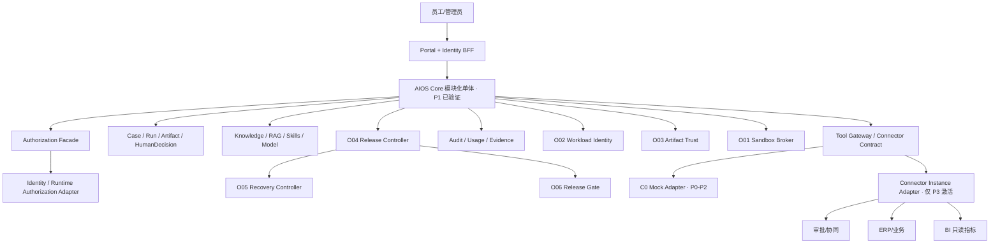

# 通用多企业 AI 员工平台：完备工程级方案 v5.1

副标题：P1 结项与 P2 启动基线  
日期：2026-07-27  
状态：候选 P2 工程执行基线，待 Product Owner 对本文准确 SHA-256 确认；P0/G0、P1/G1 已关闭；P2 已开放但 O01—O06 均未开始；P3 未开放  
事实截止：线上 D1 只追加治理账本 revision 63  
历史基线：[完备工程级方案 v5.0](通用多企业AI员工平台_完备工程级方案_v5.0.md)  
取代范围：v5.0 的“当前状态、阶段结论、剩余路径和下一步”；v5.0 继续保存 P0/P1 的历史规划与冻结技术契约  
审批模型：外部 Product Owner 只审批 G0、G1、G2、G3；不能替代目标企业 Runtime Authorization 或 Tenant 内 HumanDecision  
重要边界：本版本记录的是 `P1_SYNTHETIC_ONLY` 结项，不构成生产就绪、企业接入、企业授权或真实业务效果证明  

## 1. 更新结论

项目已经越过“能否做出通用核心”的概念验证阶段：

- P0 的 4 个工作包已完成并通过 G0；
- P1 的 C01—C19 共 19 个工作包已在冻结 Synthetic 范围内完成并通过 G1；
- 当前正式阶段是 P2，但 O01—O06 均未开始；
- P3 仍被 G2 阻断，因此不接收企业内部资料、不创建真实员工、不连接 OA、ERP/U9、BI 或其他企业系统。

截至本版本，23/37 个阶段工作包完成。这个数字只表示工作包治理状态，不表示产品已经达到 62% 的生产成熟度。P1 证明了多租户核心、个人状态、知识、Skills、Agent、HumanDecision、Tool、审计和用量机制可以在严格合成边界内工作；它没有证明生产基础设施、企业集成或真实经营效果。

最终仍要交付：

> 一个不为每位员工分配 VPS，却能提供逻辑私有个人 AI、统一权限治理、共享知识与 Skills、受控工作流、只读 KPI 分析、按任务隔离代码执行，并可重复交付给多家企业的产品。

接下来的正确路线不是继续增加 P1 功能，而是把已验证的核心变成可安装、可升级、可恢复、可审计、可长稳运行的生产候选，再进入逐 Tenant 的企业接入。

## 2. 当前执行事实

| 项目 | 当前事实 | 证据边界 |
|---|---|---|
| 总工作包 | 37 | P0 4、P1 19、P2 6、P3 8 |
| 已完成工作包 | 23/37 | 不等于生产成熟度 |
| P0 / G0 | 4/4；G0 `APPROVED` | 产品边界、合成数据、契约和安全基线已冻结 |
| G0 冻结包 | `sha256:77d8707a602a83729b557c028bd6cf87c5a0e5d921145b9dc3a5a1e79bf32a07` | 线上治理包 |
| P1 / G1 | 19/19；G1 `APPROVED` | 仅 `P1_SYNTHETIC_ONLY` |
| G1 Submission ID | `89b6b8a4-3905-407a-b40d-63d9df2b376f` | 线上只追加记录 |
| G1 GateSubmission | `sha256:edac6abf6b0a1564336ec8f5aed68e0b4d862c6ebe0de25b6f457c174e0b4c5c` | 官方阶段冻结包 |
| G1 GateDecision | `6d470d62-416a-49e0-8b0f-aaf8d66aa347`；`APPROVE` | 2026-07-27 05:52:05 +08:00 |
| 治理修订 | 63 | 线上 D1 只追加治理账本 |
| 冻结源码 | commit `6a23e93ed37eabec1201ff3a7bb00a0d9231fc49`；tree `e98a7662b8f86fc2f3a2da31531195686612bcff` | G1 技术候选 |
| 冻结证据提交 | commit `9aab0cb19d14848dfd837729dd7df07828043258`；tree `b31b584d4abccbdd164f98950dc4086f928b43dd` | Git 技术证据 |
| 本地验收文件 | `g1-acceptance-package.v1.json`；`sha256:f0533575824af61ad18c9d4b021a119beac5f94b94042cc7ff1f26db3c08fcc4` | 支撑文件，不是官方 GateSubmission 哈希 |
| Synthetic 运行 | 3 Tenant；每 Tenant 3 用户、3 角色 | 共 9 Stable Principal；不是企业身份 |
| 隔离矩阵 | 288 项；72 allow、216 deny、0 泄露、0 错归属 | 冻结 P1 测试边界 |
| 重放 | 两进程；0 重复模型执行；0 稳定业务行变化 | 非生产并发、HA 或长稳证明 |
| G1 代码验证 | C01—C19 模块证据、运行回执与官方 G1 决定已冻结 | `882/882` 不是 G1 包内独立回执，不作为官方阶段事实；当前工作树回归另行报告 |
| 外部副作用 | 0 | Connector 为 C0 Mock |
| 任意代码执行 | 关闭 | Sandbox Broker 属于 O01 |
| P2 | 0/6；已获准开始 | 生产化与运行加固 |
| P3 | 0/8；未开放 | 必须先通过 G2 |
| 生产就绪 | `NOT_VERIFIED` | 需要 O01—O06 与 G2 |
| 企业集成 | `NOT_VERIFIED` | 需要目标企业授权与 T01—T08 |

## 3. 事实源与方案持续更新规则

### 3.1 事实源优先级

1. **线上 D1 只追加治理账本**：当前工作包执行状态、GateSubmission、GateDecision 和 revision 的权威来源。
2. **Git 冻结证据**：源码、测试、运行回执、证据文件和独立复核的权威来源。
3. **`work-package-manifest.v1.json`**：37 个工作包的定义、初始状态和依赖基线，不是 revision 63 的当前投影。
4. **进度中心**：只投影 Manifest + D1 事件，不自行保存第二套事实。
5. **方案文档**：说明目标、边界、顺序和验收，不替代运行证据或阶段决定。

本地 `governance-events.v1.json` 是种子/示例，不是线上 D1 的镜像。`g1-acceptance-package.v1.json` 是审批前冻结支撑文件，不得原地改写成审批后状态。G1 决策作为独立只追加事实存在。

### 3.2 版本规则

- 阶段门通过、工程范围变化或关键架构结论变化时，生成新方案版本；
- 已参与冻结证据的旧版本不原地修改；
- 新版本只向前更新，不追溯改变 G0/G1 的验收含义；
- 每个新版本都写明事实截止 revision、已证实、未证实和下一阶段；
- 工作包的实施、验证和阶段批准必须分别展示；
- P2 开始前应追加一个引用 v5.1 的治理事件或新 Manifest 版本，但不得修改 G1 已冻结的 scope。

下一次正常更新点是：P2 任一工作包验收造成关键路线变化，或 G2 提交前。通过 G2 后发布 v5.2，记录 P2 结项与 P3 启动基线。

## 4. 最终理想效果

| 视角 | 最终效果 | 不能接受的替代品 |
|---|---|---|
| 员工 | 每人一个逻辑私有助手，拥有独立会话、确认式记忆、权限和配额 | 每人一台 VPS；共享一个万能账号 |
| 上级 | 管理正式 Skills、预算、成果、工作流和业务审计 | 默认偷看私人会话或个人记忆 |
| 知识 Owner | 发布带来源、版本、ACL、有效期和撤回能力的知识 | 把共享网盘全部灌进向量库 |
| Skill Owner | 测试、批准、灰度、撤回和回滚工作方法 | 员工随意运行未审脚本 |
| 业务人员 | AI 准备候选，人对完整对象作决定，系统幂等提交并回读 | 聊天中说“同意”就直接写系统 |
| 管理分析 | 从 BI 只读获取认证 KPI、口径、as-of 和证据 | AI 自造 KPI 或暗中评价员工 |
| 代码任务 | 需要时创建一任务一 microVM，默认断网，任务后销毁 | 应用服务器直接执行员工代码 |
| 企业 IT | 通过 Tenant 配置、策略和 Connector Instance 接入 | 为每家企业 Fork 一套核心代码 |
| 平台运营 | 可安装、升级、回滚、恢复、定容、审计和退出 | 只能在开发者电脑运行的演示 |

最终成功要同时满足：

1. 一个 Release 可创建多个相互隔离的 Tenant；
2. 不为员工分配独立 VPS，仍能保证 Tenant、Principal、会话、记忆、权限、用量和成本归属；
3. 所有读取、检索、下载、Tool、管理和 Sandbox 路径统一服务端授权；
4. 回答带 EvidenceRef，证据不足时拒答；
5. 高风险动作绑定完整 Artifact Hash、真实 HumanDecision、幂等 Commit 和独立 Readback；
6. 任意代码只在短生命周期隔离执行面运行；
7. 安装、升级、回滚、备份恢复、灾备和 Tenant 退出均实际演练；
8. KPI 只从认证语义层只读进入，指标版本、权限和新鲜度可追溯；
9. 接入第二个 Tenant 时不 Fork Product Core；
10. 个人 AI 体验、上级治理与员工隐私边界同时成立。

## 5. P1 之后的目标架构



### 5.1 模块与 seam

P1 的 C01—C19 继续作为模块化单体中的深模块，不拆成 19 个服务。P2 只在隔离、密钥、制品、部署和恢复确实具有不同生命周期与运维证据时形成外部 seam。

| 深模块 | 小接口必须表达 | Adapter |
|---|---|---|
| Tenant Execution Context | 服务端得出的 Tenant、Principal、tenant kind、policy version、security epoch | P2 Synthetic Adapter；P3 Runtime Authorization Adapter |
| Authorization Facade | actor、action、resource、可信上下文；返回 allow/deny 和 decision ref | OpenFGA production/test Adapter |
| AIOS Run | TaskEnvelope；返回 Run、Artifact、EvidenceRef 和确定性状态 | PostgreSQL production/test Adapter |
| HumanDecision | 冻结 Artifact Hash 与有效权限；返回不可变决定 | Synthetic Test Adapter；P3 Enterprise Human Adapter |
| Connector Instance Runtime | `operation_id`、instance、stage、credential lease、policy；返回标准 Receipt | C0 Disabled/Mock Adapter；P3 真实窄 Adapter |
| Workload Identity | 工作负载意图和最小 scope；返回短期租约 | OpenBao/Kubernetes Adapter；测试 Adapter |
| Artifact Trust | Digest；返回签名、SBOM、Provenance 和准入决定 | OCI/Harbor Adapter；测试 Adapter |
| Sandbox Broker | JobSpec；返回执行 Receipt、输出引用和销毁证据 | Kata/Firecracker Adapter；假执行 Adapter |
| Release/Recovery | Release Manifest 或 Recovery Point；返回可验证 Receipt | Kubernetes/GitOps/Backup Adapter；本地测试 Adapter |

接口要隐藏实现复杂度；调用者不能传入可扩大权限的 Tenant、角色、Connector Stage 或凭据。生产 Adapter 和测试 Adapter 共用同一接口，测试通过接口观察结果，不穿透实现内部状态。

### 5.2 P2 必须补齐的产品化 seam

P1 为安全测试而有意硬编码 `SYNTHETIC`、C0 和无外部副作用。G2 前必须在不放宽 P0—P2 数据边界的情况下完成：

1. 把分散的 Synthetic 判断收口到服务端 `TenantExecutionContext + tenant-kind policy`，业务模块不自行猜测 Tenant 类型；
2. 保留 Synthetic Adapter，并增加默认拒绝的 Enterprise Adapter seam；P3 才注入真实 Runtime Authorization；
3. 为 Connector 提供 `ConnectorInstanceRuntime`，P2 只启用 C0 Disabled/Mock，P3 才注入真实 Adapter；
4. 让 P3 的 Applicability、GateSubmission 和 GateDecision 绑定一个明确 `onboarding_scope_id / tenant_id`；
5. 增加只追加的 Applicability 决定命令，使 OPTIONAL 可以在启动前变为 REQUIRED 或 NOT_IN_SCOPE；
6. 使用纯合成的 Enterprise-mode 契约 Fixture 验证接口，不创建真实 Enterprise Tenant，不接收企业资料。

这些是 O04/G2 的跨模块收口条件，不新增第 38 个工作包，也不改变已批准的 P1 范围。

## 6. P1 结项能力与剩余边界

| ID | 已验证能力 | 仍未证明/后续归属 |
|---|---|---|
| C01 | Synthetic 用户门户与身份 BFF；后端授权不可绕过 | 生产部署、可用性和真实用户体验：O04/O06、T02/T08 |
| C02 | Tenant 治理门户与服务端重鉴权 | 生产管理面和真实组织：O04/O06、T02 |
| C03 | 幂等 Tenant Registry、生命周期、Outbox、PostgreSQL 重放 | Enterprise 创建 seam、HA/恢复：O04/O05、T01 |
| C04 | 合成 OIDC/SAML/Provisioning、乱序与撤权 | 真实 IdP/SCIM：T02 |
| C05 | Stable Principal、subject/actor/委托链 | 企业身份映射：T02 |
| C06 | OpenFGA/PEP 与 288 项正交授权隔离 | 角色权威输入、生产 PDP 持久化/HA：O02/O04/O05、T02 |
| C07 | SQL/向量/文件/对象/搜索/缓存/恢复副本隔离 | 生产对象存储、网络、敌对 same-UID：O04/O05/O06 |
| C08 | Case/Run/Artifact/Outbox 与跨进程重放 | 生产并发、迁移、HA：O04—O06 |
| C09 | 确认式个人记忆、删除和跨用户隔离 | 生产保留、备份和真实同意：O05、T02/T08 |
| C10 | 知识目录、来源、版本和解析基线 | 生产对象/解析容量和企业知识：O04/O06、T03 |
| C11 | 授权前置 RAG、引用和拒答 | 企业 ACL、真实质量基线：T03/T08 |
| C12 | 显式 Agent 状态图、路由和恢复 | 生产容量、真实流程：O06、T08 |
| C13 | Skills 哈希、测试、发布、撤回与回滚；脚本关闭 | OCI/SBOM/签名与脚本沙箱：O03/O01 |
| C14 | 数据/地区/权限硬过滤后的模型路由和用量 | 生产密钥、Provider 容量和真实成本：O02/O06 |
| C15 | Synthetic Test Decision、完整哈希、事务副作用、回读 | 真实 HumanDecision/外部副作用：T07 |
| C16 | Tool 发现、确认、执行三阶段重鉴权 | 短期生产凭据和真实 Tool：O02、T04/T05 |
| C17 | 三类 Connector Template、SDK 与 Mock Lab | ConnectorInstanceRuntime 和真实 Adapter：O04、T04—T06 |
| C18 | 追加审计、来源链、恢复与篡改检测 | 签名检查点、完整 C15 intent 绑定、生产保留：O02/O05 |
| C19 | 合成用量、配额、成本和跨进程归属 | 真实基础设施成本、并发、HA、长稳：O04—O06 |

G1 的批准意味着上述 P1 范围已关闭，不代表每项“生产已完成”。P2 只做生产化、隔离执行、供应链、交付、恢复和容量，不重新扩张聊天功能。

## 7. 剩余路线与关键路径

```text
P0/G0 关闭
→ P1/G1 关闭
→ O02 密钥/工作负载身份
→ O03 软件供应链
→ O01 沙箱 与 O04 可重复交付并行
→ O05 HA/恢复/灾备
→ O06 SLO/容量/长稳/发布
→ G2
→ T01—T08 按 Tenant Applicability
→ G3
```

| 阶段 | 当前状态 | 工作包 | 目标 |
|---|---|---|---|
| P0 | `CLOSED` | F01—F04，4/4 | 产品边界和门禁 |
| P1 | `CLOSED` | C01—C19，19/19 | Synthetic 通用产品核心 |
| P2 | `OPEN / NOT_STARTED` | O01—O06，0/6 | 可重复交付的生产候选 |
| P3 | `BLOCKED_BY_G2` | T01—T08，0/8 | 一个真实 Tenant 的接入与试点 |

O02 是当前唯一根工作包。O03 依赖 O02；O01 和 O04 都依赖 O02/O03；O05 依赖 O04；O06 依赖 O01/O04/O05。不得为了展示并行进度跳过依赖。

## 8. P2 总体 Definition of Done

P2 结束时必须证明：

1. 同一 Release Manifest 可从空环境重复安装；
2. 服务、Tool 和沙箱只获得短期、最小 scope 的工作负载身份；
3. 只有固定 Digest、完成 SBOM/Provenance、签名和准入的制品可以运行；
4. 不可信代码一任务一 microVM、默认断网、任务后销毁；
5. 升级、迁移、回滚和新 Tenant 初始化可重复；
6. 数据库、对象、审计、配置和必要密钥材料可实际恢复；
7. 恢复后重新证明 Tenant/用户/角色隔离和审计完整；
8. 固定 capacity profile 下通过 2 倍峰值、72 小时长稳、依赖故障和 Canary 回滚；
9. P1 的 19 项关键回归在固定 Release Digest 上通过；
10. 安装包和运行环境仍不含企业资料、企业身份、企业地址、企业凭据或真实 Connector。

### 8.1 可机器判定的 Acceptance Profile

O02 开工前必须先冻结 `P2 Acceptance Profile` 及其 SHA-256。它至少包含：

- Release/环境/组件范围、Reference Capacity Profile 和测试 Fixture；
- 每个指标的名称、单位、采集点、统计口径、百分位、观察窗口、阈值和最大允许排除量；
- Credential Lease TTL、强制撤销传播时间、RPO、RTO、SLO、错误预算、峰值、长稳和自动回滚阈值；
- 漏洞可利用性、恶意软件、秘密和许可证的供应链阻断条件，以及例外批准人、补偿控制和最长有效期；
- 零容忍项、原始证据格式、实现负责人、独立复核人和独立性声明；
- 失败时的停止条件、整改规则和必须重跑的矩阵。

开始采集验收证据后不得放宽阈值。任何变更都必须形成新版本和新哈希，并使旧运行结果失效。

在没有企业资料的 P2 中，先采用以下 Synthetic Reference 默认值；只能在开工前收紧，不能在看过测试结果后放宽：

| 项目 | P2 默认阈值 |
|---|---|
| O02 短期凭据 | 普通服务/Tool 动态租约 TTL 不超过 15 分钟；强制撤销后 60 秒内拒绝新建、续租和再次使用 |
| O03 无条件阻断 | 恶意软件、已验证秘密、禁止许可证、已知正在被利用的漏洞，或未固定/未签名制品一律拒绝；G2 不接受例外 |
| O03 Critical/High | 未关闭的 Critical 以及可到达生产运行路径的 High 默认拒绝；仅误报可由独立供应链复核人签署最长 7 天例外，可证明不可到达的 High 可签署最长 30 天例外；两者都必须有补偿控制并自动失效 |
| O05 恢复 | 可变产品状态 RPO 不超过 15 分钟；隔离恢复环境中的全栈 RTO 不超过 4 小时；恢复出的审计事件和签名检查点 100% 可验证，缺口必须可检测并界定 |
| O06 目标负载 | 连续 72 小时 Core 可用率不低于 99.9%，非策略拒绝的 5xx 比例不高于 0.1%，跨 Tenant/越权/重复副作用为零 |
| O06 两倍峰值 | 持续 60 分钟，非策略拒绝的 5xx 比例不高于 1%，无数据丢失；触发 Canary 失败后 10 分钟内自动回滚 |
| O06 Core 延迟 | 排除模型 Provider 等外部等待和批量摄取后，Core API p95 不高于 500 毫秒；必须同时报告 p50/p95/p99 |

P3 的 T02 撤权时间和 T08 业务效果不使用通用伪目标。它们必须在每个 Tenant 开工前冻结带单位、样本量、基线窗口、目标窗口和失败阈值的 `Tenant Acceptance Profile`，并绑定 Onboarding Package Hash。

## 9. P2 六个工作包

### O02 密钥、短期凭据与工作负载身份

- **当前状态**：`NOT_STARTED`；P2 根工作包。
- **结果**：服务、Tool、审计签名和后续沙箱只在需要时获得短期、限定范围的身份与凭据。
- **范围**：Secret Manager、动态租约、ServiceAccount、CSI、轮换、撤销、Break-glass、审计检查点签名和恢复。
- **seam**：`WorkloadIdentity` 接口只接收可信工作负载意图和最小 scope，不接受模型生成的凭据名。
- **默认实现**：OpenBao + Kubernetes 短期 ServiceAccount + CSI；跨集群/VM/裸机出现后再评估 SPIRE。
- **P1 差距映射**：C06 角色/主体权威输入、C14 Provider 密钥、C16 Tool 短凭据、C18 签名检查点。
- **证据**：跨 Tenant/服务/环境拒绝；租约到期；轮换；泄露撤销；HA/Unseal/恢复；Break-glass 演练；Prompt/日志/镜像秘密扫描。
- **验收**：秘密不进入 Git、镜像、Prompt、日志和文档；Lease TTL 与强制撤销传播满足冻结的 Acceptance Profile；轮换与恢复后签名 100% 可验证。
- **不做**：不把工作负载身份当 Enterprise User；不把 Root Token 放进应用。
- **责任/规模**：密钥与工作负载身份负责人，L。

### O03 软件供应链与制品信任

- **当前状态**：`NOT_STARTED`；依赖 O02。
- **结果**：只有来源清楚、版本固定、扫描、签名并获准的镜像和 Skill 制品可以运行。
- **范围**：依赖锁、OCI、Release Manifest、SBOM、漏洞扫描、Provenance/Attestation、签名、准入、例外到期和紧急撤回。
- **seam**：`ArtifactTrust` 对 Digest 返回可审计决定；调用者不能用标签或文件名代替 Digest。
- **默认实现**：Harbor/ORAS + Cosign + Syft/Trivy + Kyverno；遵循 SLSA、in-toto、CycloneDX。
- **P1 差距映射**：C13 Skill 制品签名、C17 Connector Template 制品、O01/O04 的可信运行输入。
- **证据**：锁文件、Digest、SBOM、漏洞报告、来源、签名、准入拒绝、撤回和许可证清单。
- **验收**：未固定 Digest、未签名、缺必要材料或命中冻结供应链阻断策略的制品被拒绝；所有例外满足批准人、理由、补偿控制和最长有效期并自动失效；撤回后新运行无法解析。
- **不做**：不把签名等同业务正确；不同时维护同义双制品真相。
- **责任/规模**：软件供应链安全负责人，L。

### O01 Sandbox Broker 与隔离执行

- **当前状态**：`NOT_STARTED`；依赖 O02、O03。
- **结果**：代码或插件任务使用一任务一实例的短生命周期 microVM。
- **范围**：Broker、模板、专用节点、调度、输入暂存、默认拒绝出口、资源限制、短期身份、输出扫描、Reaper、Kill Switch 和销毁证据。
- **seam**：`SandboxBroker` 接收版本化 JobSpec，只返回输出引用和不可变 Receipt；不接受宿主路径、生产连接串或万能网络。
- **默认实现**：Kata Containers；需要更强隔离时使用 Firecracker；gVisor 只限固定解析或中低风险任务。
- **P1 差距映射**：C13 任意脚本保持关闭，直到 O01/O02/O03 同时验收。
- **证据**：启动/销毁、逃逸、横移、出口、DoS、残留、节点失联、超时、取消、输出恶意内容和 Kill Switch。
- **验收**：每任务新实例；无宿主机、Docker Socket、长期密钥和默认网络；任务后状态不可恢复。
- **不做**：不让沙箱承担报价、合同、订单、OA 或 ERP 正式写回。
- **责任/规模**：沙箱与运行时安全负责人，XL。

### O04 可重复打包、部署、升级与回滚

- **当前状态**：`NOT_STARTED`；依赖 O02、O03 和 C01—C19。
- **结果**：从空环境安装企业无关产品，可靠升级、回滚，并为 P3 提供真正可实例化的产品接口。
- **范围**：Compose 开发包、Helm、环境配置、迁移、Tenant 初始化、GitOps、兼容矩阵、回滚和 P2 跨模块收口。
- **seam**：`ReleaseController` 只接受固定 Release Manifest；生产差异通过配置和 Adapter 注入，不 Fork 核心。
- **默认实现**：Docker Compose 仅开发；Kubernetes + Helm + Argo CD 作为生产候选；多环境重复后再评估 OpenTofu。
- **P1 差距映射**：生产 OpenFGA/PostgreSQL/对象存储、TenantExecutionContext、ConnectorInstanceRuntime、P3 per-Tenant Applicability/Gate scope。
- **必须完成的跨模块收口**：
  1. server-derived TenantExecutionContext；
  2. 默认拒绝的 Enterprise Runtime Authorization Adapter seam；
  3. C0 Disabled/Mock 与 P3 真实 Adapter 共用的 ConnectorInstanceRuntime；
  4. `onboarding_scope_id / tenant_id` 绑定的 P3 进度与 GateSubmission；
  5. P3 Applicability 的只追加决定命令和依赖闭包；
  6. P1 Synthetic 兼容回归。
- **证据**：空环境安装、重复安装、迁移、升级、回滚、新 Tenant 初始化、配置差异、企业数据/Secret 扫描和接口契约。
- **验收**：同一 Release Manifest 可复现；失败升级受控回退；回退后数据、权限和审计一致；P3 Gate 可按独立 Tenant scope 计算。
- **不做**：安装包不带企业名称、账号、端点、凭据或 Connector Instance。
- **责任/规模**：平台交付/GitOps 负责人，XL。

### O05 高可用、备份、恢复与灾备

- **当前状态**：`NOT_STARTED`；依赖 O04。
- **结果**：数据库、对象、制品、配置和必要密钥材料可以在隔离环境实际恢复并达到冻结 Acceptance Profile 的 RPO/RTO。
- **范围**：PostgreSQL HA/PITR、对象版本/复制、Registry/Git/Kubernetes 恢复、删除标记、审计签名和灾备演练。
- **seam**：`RecoveryController` 使用不可变 Recovery Point，返回实际恢复与复测 Receipt。
- **默认实现**：CloudNativePG + pgBackRest 或合格托管 PostgreSQL；Velero；对象存储原生版本/复制。
- **P1 差距映射**：C03/C07/C09/C18 的生产持久化、删除、恢复、审计链和跨 Tenant 复测。
- **证据**：随机恢复点、全栈恢复、带起止时间的实测 RPO/RTO、恢复后权限/隔离/审计/签名复测和失效备份负例。
- **验收**：达到冻结的 RPO/RTO 数值；业务数据、审计和配置一致；恢复后零跨 Tenant 泄露；删除与保留策略继续成立。
- **不做**：备份任务成功不能替代恢复成功。
- **责任/规模**：数据库与灾备负责人，XL。

### O06 SLO、容量、压测、混沌与发布工程

- **当前状态**：`NOT_STARTED`；依赖 O01、O04、O05 和 C01—C19。
- **结果**：在冻结负载画像下证明容量、长稳、故障恢复、Canary 和自动回滚。
- **范围**：capacity profile、SLI/SLO、错误预算、峰值、72 小时长稳、依赖故障、Schema 兼容、Canary、自动中止和成本账本。
- **seam**：`ReleaseGate` 只读取不可变 Release/Capacity/Test Receipt，不能用人工口头说明覆盖零容忍失败。
- **默认实现**：k6 或 Locust + OpenTelemetry/Prometheus + Argo Rollouts；基础故障测试成熟后再引入 Chaos Mesh。
- **P1 差距映射**：C01/C02 可用性、C08/C15 并发、C10/C11 解析检索容量、C12/C14/C19 性能与真实基础设施成本。
- **证据**：2 倍目标峰值 60 分钟、目标负载 72 小时、故障矩阵、Canary、自动回滚、低基数监控和成本对账。
- **验收**：冻结 Acceptance Profile 中的 SLO、错误预算、延迟、错误率和回滚时间全部达标；异常自动停止发布；不得用缩小请求总量或改变口径掩盖长稳不足。
- **不做**：不按员工总人数直接定容；合成负载不冒充 P3 真实观察。
- **责任/规模**：性能与发布工程负责人，XL。

## 10. P1 限制到 G2 的闭环

| G1 接受限制 | P2 闭环位置 | G2 必需证据 |
|---|---|---|
| OpenFGA 为锁定真实二进制但临时存储 | O04/O05 | 生产持久化、HA、恢复后授权回放 |
| 文件/对象为受控本地根 | O04/O05/O06 | 生产对象策略、敌对 same-UID、恢复和负载 |
| C18 未独立携带完整 C15 Audit Intent Hash | O02/O05 + G2 回归 | 完整 intent 绑定、签名检查点、恢复验证 |
| 任意代码关闭 | O01—O03 | microVM、短凭据、可信制品、销毁 |
| 无 Kubernetes/供应链闭环 | O03/O04 | Release Manifest、SBOM、签名、准入、重装/回滚 |
| 无真实并发、容量和长稳 | O06 | 并发、峰值、72 小时、故障和成本 |
| 无 HA/PITR/灾备 | O05 | 随机恢复点、RPO/RTO、全栈复测 |
| P1 接口为 Synthetic/C0 特化 | O04 | TenantExecutionContext、ConnectorInstanceRuntime、Enterprise 默认拒绝 Adapter |
| P3 不能按 Tenant 动态决定 Applicability/Gate scope | O04 | onboarding scope、只追加 applicability、独立 Gate hash |
| 无企业身份、资料和 Connector | P3 | 不能在 G2 前关闭；T01—T08 |

企业接入限制不是 P2 缺陷，不能通过加入企业样本“提前闭环”。

## 11. G2：P2 → P3

G2 只接受同一个固定 Release Digest 上的冻结证据。必须同时满足：

1. O01—O06 全部通过；
2. 同一 Release Digest 重跑 F02、F04、C01—C19 和三 Tenant 隔离关键回归；
3. `TenantExecutionContext` 已替代调用者自行解释 Tenant、Principal、tenant kind 和 policy；
4. 没有有效 P3 Onboarding Package 时，Enterprise 激活失败关闭；
5. 在两个彼此隔离的合成 onboarding scope 中，分别完成 Applicability、依赖闭包、证据和 G3 状态模拟；
6. GateSubmission 支持 `scope_type`、`scope_id` 和 `product_release_digest`，G3 不再是无 Tenant scope 的全局单例；
7. ConnectorInstanceRuntime 使用纯 Synthetic Mock Instance 通过实例归属、Stage、撤权、SSRF、重放、超时、停用和 Kill Switch 测试，真实 Enterprise Connector Instance 数量仍为零；
8. Sandbox 一任务一 microVM，并绑定 Tenant、Principal、Run、Artifact/Code Digest、资源、出口和 Credential Lease；
9. 镜像、Skill 和部署制品固定 Digest，具备 SBOM、Provenance、签名、准入、撤回和例外到期证据；无未关闭的供应链阻断项，无针对无条件阻断类别的例外；
10. 从空环境安装、重复安装、升级、失败回滚通过，回滚后数据、权限和审计一致；
11. 实际恢复数据库、对象、授权、身份投影、配置、审计和签名，恢复后重跑跨 Tenant 负例；
12. 冻结 Reference Capacity Profile 上完成 2 倍峰值 60 分钟、目标持续负载 72 小时、SLO、错误预算、Canary 和自动回滚；
13. Release 和证据包中的企业名称、用户、资料、端点、凭据和真实 Enterprise Connector Instance 为零；
14. O01、O05 和最终 G2 具有机器可校验的独立复核回执，包含 reviewer identity、与实现者不同的独立性声明、复核范围、发现、排除项、时间和证据哈希，且无未关闭的 Critical/High；
15. P2 Frozen Evidence Package 规范化并生成准确 SHA-256；
16. Product Owner 对该准确哈希作 `APPROVE`，或只对非门控范围作合法 `APPROVE_WITH_EXCLUSIONS`。

G2 通过只表示产品成为企业无关的生产候选并允许开始 P3，不表示任一企业已经接入。

## 12. P3 企业接入边界

### 12.1 入口

P3 开始前必须同时存在：

- G2 `APPROVED`；
- 明确的目标企业；
- 可验证的 Enterprise Authorized Onboarding Principal；
- 不含明文秘密的 Enterprise Onboarding Package；
- 初始 Data Policy Pack；
- 选定的 Tenant Isolation Profile；
- 预先冻结的主场景、用户批次、质量和停止条件。

P3 前可以在产品外独立 Public Context Registry 收集有来源的公开信息，但它不能变成企业内部事实、Synthetic Fixture、评测真值或默认发行包。P3 中只有经目标企业重新确认的内容才能进入 Tenant。

### 12.2 Tenant Isolation Profile

| 档位 | 计算 | 数据库/向量 | 对象/密钥/备份 | 部署 |
|---|---|---|---|---|
| I1 逻辑强隔离 | 共享 Worker | 共享集群，`FORCE RLS` 与 Tenant 约束 | 独立前缀、策略、密钥 Namespace 和恢复验证 | 共享 Product Core |
| I2 独立数据隔离 | 共享 Worker 或专用池 | 独立数据库/索引 | 独立对象、密钥和备份链 | 共享控制面，可独立数据面 |
| I3 独立部署隔离 | 专用计算 | 独立数据库/索引 | 独立对象、密钥、备份和恢复域 | 同一 Release 的独立部署 |

隔离档按目标企业 Runtime Authorization 和风险基线选择。任何档位都不能 Fork Product Core。降级需要新 Data Policy Pack、迁移/回滚计划和完整复测。

## 13. P3 八个工作包模板

### T01 企业接入控制、Tenant 创建与 Data Policy Pack

- **结果**：核验企业授权后创建全新的 `tenant_kind=ENTERPRISE` Tenant。
- **范围**：授权引用、Onboarding Package Hash、Isolation Profile、数据分级、模型/地区、隐私、保留/删除、审计、备份和配额。
- **验收**：无 Synthetic ID、身份、知识、密钥或存储复用；所有投影一致；Tenant 可停用和删除；秘密只以 Secret Reference 出现。
- **不做**：Product Owner 不替代企业授权接入人。
- **责任/规模**：产品 Onboarding 负责人 + 企业授权接入人，L。

### T02 身份、组织与账号生命周期实例

- **结果**：将真实企业身份、组织和角色映射为 Tenant 内 Stable Principal 和授权关系。
- **范围**：OIDC/SAML、SCIM/Admin Adapter、组织/角色、兼岗、入调离、撤权、乱序和重放。
- **验收**：真实用户映射稳定；达到该 Tenant 冻结 Acceptance Profile 的撤权时间；离职账号不能被重放恢复；同邮箱不自动合并。
- **不做**：Product Owner 不创建企业员工或分配企业角色。
- **责任/规模**：产品身份接入负责人 + 企业身份管理员，L。

### T03 企业知识与 Skills 接入实例

- **结果**：按 Owner、版本、ACL 和有效期分批接入知识与首批 3—5 个 Skills。
- **范围**：资料清单、隔离解析、权限发布、案例集、Skill 配置、评测、撤回和删除。
- **验收**：未授权资料不进入；来源位置正确；过期、撤回和删除传播；3—5 个 Skill 达到冻结任务基线。
- **不做**：不一键全盘导入，不把企业差异写入核心分支。
- **责任/规模**：产品知识/Skill 负责人 + 企业知识 Owner，L。

### T04 审批/协同系统 Connector Instance

- **结果**：建立可停用、可审计的审批/协同系统窄连接。
- **范围**：C0、C1 批准快照、C2 窄只读、事件、可选 `prepare_*`、撤权和 Kill Switch。
- **验收**：T04 最多 C2/Prepare；状态不能继承自其他 Tenant；任何 Commit 移交 T07。
- **不做**：暂时无法接 OA 时保持 C0 或预先标记 `NOT_IN_SCOPE`；不通过浏览器抓取绕过接口。
- **责任/规模**：产品 Connector 负责人 + 企业协同接口负责人，L。

### T05 ERP/业务系统 Connector Instance

- **结果**：为订单、库存、交付等提供窄、只读、版本化的受控查询。
- **范围**：C0—C2、`operation_id`、Canonical Mapping、Query Service、来源、版本、新鲜度和可选 `prepare_*`。
- **验收**：字段、来源、版本和新鲜度可验证；无任意 SQL 和生产数据库账号；Commit 只进入 T07。
- **不做**：不让模型生成 SQL 直连生产库。
- **责任/规模**：产品业务 Connector 负责人 + 企业源系统接口负责人，XL。

### T06 BI/认证指标 Connector Instance

- **结果**：只读获取认证 Metric、口径、维度、权限和 as-of，供 KPI 解释与建议。
- **接口**：`MetricQuery(context, metricRef, dimensions, asOf)`；类型层面无写入方法。
- **范围**：Metric Catalog、定义版本、语义契约、权限、新鲜度、修订、空值和 EvidenceRef。
- **验收**：指标引用可追溯；越权为零；口径和 as-of 正确；C3 永远拒绝。
- **不做**：不重新发明 KPI 口径；不把 C19 的平台用量当业务 KPI；不以聊天量或 Token 暗中评价员工。
- **责任/规模**：产品 BI Connector 负责人 + 企业指标 Owner，L。

### T07 C3 受控写回、回读与对账

- **结果**：对确有需要的 T04/T05 候选动作完成 Prepare、HumanDecision、Commit、Readback、对账和补偿。
- **接口**：Connector Runtime 不提供通用 Commit；唯一写入口是 `ControlledAction`。
- **入口**：同一 Tenant、同一 Connector Instance、已验收 C2、已冻结 Prepare Operation/契约、匹配的 Runtime Authorization。
- **验收**：具备真实业务权限的 Enterprise User 对完整 Artifact Hash 作 HumanDecision；执行前重验权限、哈希和有效期；重复请求不重复提交。
- **不做**：T06 永不进入；沙箱不写回；Product Owner 不批准业务动作。
- **责任/规模**：产品受控写回负责人 + 企业运行授权主体/动作批准人，XL。

### T08 真实试点、切换、运行与退出

- **结果**：在一个冻结主场景和小批用户中证明真实质量、效率、安全、恢复、成本和退出能力。
- **范围**：基线、用户批次、培训、支持、Canary、事件响应、回滚、导出、删除、Connector 停用和验收包。
- **验收**：Applicability 依赖闭包有效；质量、效率、安全与成本指标达到该 Tenant 冻结 Acceptance Profile 的目标；停止条件有效；Tenant 可独立停用、导出、删除和回滚。
- **不做**：失败项目不能事后改为 `NOT_IN_SCOPE`；合成绿灯不代替真实观察。
- **责任/规模**：产品试点负责人 + 企业试点/支持负责人，XL。

## 14. 首个 Tenant 的推荐 Applicability

在 OA/ERP/BI 暂时无法接入时，不需要阻塞首轮低风险试点：

| 工作包 | 首轮默认 | 条件 |
|---|---|---|
| T01 | `REQUIRED` | 所有真实 Tenant 必选 |
| T02 | `REQUIRED` | 真实员工试点必选 |
| T03 | `REQUIRED` | 首轮以知识与 Skills 为主 |
| T04 | `NOT_IN_SCOPE` 或后续 `REQUIRED` | OA/协同接口和授权可用后再启用 |
| T05 | `NOT_IN_SCOPE` 或后续 `REQUIRED` | ERP/业务接口和授权可用后再启用 |
| T06 | `NOT_IN_SCOPE` 或后续 `REQUIRED` | 宣称真实 KPI 能力时必须为 REQUIRED |
| T07 | `NOT_IN_SCOPE` | 只有确有写回价值并完成 C2 时启用 |
| T08 | `REQUIRED` | 真实试点与退出证明 |

这不是降低最终目标。后续启用 OA、ERP、BI 或 C3 时，为同一 Tenant 形成新 Applicability Snapshot、证据和 G3 Submission，不能静默修改已批准范围。

任意 Skill 脚本只有在 O03 签名准入、C06 授权和 O01 Sandbox 三者同时满足时才能执行。

## 15. G3：每 Tenant 最终验收

每次 G3 Submission 必须绑定：

```text
onboarding_id
tenant_id
product_release_digest
onboarding_package_hash
data_policy_pack_hash
isolation_profile
capacity_profile
per_tenant_applicability_snapshot
evidence_hashes
```

同时满足：

1. 企业授权主体有效，秘密只以引用出现；
2. 全新 Enterprise Tenant 无任何 Synthetic 资源复用；
3. T02 为 `REQUIRED` 时，入调离、乱序、撤权和会话失效达到该 Tenant 冻结 Acceptance Profile；
4. 所有 REQUIRED 工作包及依赖闭包通过，NOT_IN_SCOPE 在实施前冻结；
5. T03 为 REQUIRED 时，ACL、来源、版本、撤回、删除和 3—5 个 Skill 通过；
6. T06 为 REQUIRED 时，真实 Metric Definition、权限、新鲜度、as-of、修订和 EvidenceRef 通过；
7. T04/T05 只到 C2/Prepare；T07 为 REQUIRED 时，同一实例才可进入 C3；
8. 每个 C3 动作绑定 Runtime Authorization、Artifact Hash、HumanDecision、幂等 Commit、独立 Readback 和对账；
9. T08 达到质量、效率、安全、成本、恢复、停止和退出基线；
10. Tenant 可独立停用、导出、删除和回滚；
11. Product Owner 对该 onboarding scope 的准确 G3 哈希作决定。

首个 G3 只能声明“首个 Tenant 试点通过”。“已验证可重复多企业交付”必须由第二个独立 Tenant 使用同一 Product Core Release、零核心代码 Fork，按该 Tenant 冻结的 Applicability、依赖闭包和 REQUIRED 工作包重新完成 G3 后证明。无需新增工作包或新 Gate。

## 16. 五条端到端产品路径

### 16.1 个人知识助手

```text
登录
→ 服务端恢复 Tenant + Stable Principal
→ 授权 PEP
→ 召回本人确认记忆
→ 权限前置 RAG
→ 允许集合内模型
→ 返回带 EvidenceRef 的回答
→ Audit + Usage
```

### 16.2 共享 Skill 工作

```text
选择已发布 Skill Digest
→ 校验 Tenant/部门/用户权限
→ 运行显式状态图
→ 调用知识或窄 Tool
→ 生成 Artifact
→ 独立规则复核
→ 返回结果或进入人工门
```

### 16.3 KPI 分析

```text
用户提出 KPI 问题
→ 校验 Metric 权限
→ T06 MetricQuery 只读查询
→ 绑定定义版本、维度、as-of 和新鲜度
→ AI 解释变化、证据和不确定性
→ 人决定管理动作
```

### 16.4 高风险正式动作

```text
prepare_* 生成 DraftArtifact
→ 确定性规则校验
→ 展示完整对象、差异、来源和风险
→ RFC 8785 + SHA-256
→ Enterprise User 作 HumanDecision
→ 执行前重验身份、权限、哈希和 Connector Stage
→ 幂等 Commit
→ 独立 Readback
→ 对账、审计；异常则补偿/人工处理
```

### 16.5 代码执行

```text
用户提交任务
→ 授权 + 风险/资源/出口策略
→ 校验代码与模板 Digest
→ 领取短期 Credential Lease
→ 创建一任务一 microVM
→ 默认断网执行
→ 扫描输出并写不可变 Receipt
→ 撤销租约、销毁实例、确认无残留
```

代码执行能力不等于正式业务写回能力。

## 17. 测试与证据矩阵

| 证据层 | P1 当前事实 | P2/P3 还需证明 |
|---|---|---|
| Schema/静态 | 合成契约、Lint、受保护数据边界通过 | Release/Onboarding/Applicability 新 Schema、SBOM、秘密扫描 |
| 单元/属性 | 状态机、哈希、乱序、重放通过 | Enterprise 默认拒绝、租约、准入、恢复状态机 |
| 契约 | Portal/Core/Model/Tool/Connector Mock 通过 | TenantExecutionContext、ConnectorInstanceRuntime、每 Tenant Gate |
| 持久化集成 | PostgreSQL、OpenFGA、两进程重放通过 | 生产持久化、HA、对象存储、并发和迁移 |
| 多租户负例 | 288 项，零泄露/错归属 | 生产网络、对象、恢复、microVM 与 P3 真实 Tenant |
| AI 质量 | 合成 RAG/Agent/Skill 基线 | 企业知识、真实任务、真实引用和用户反馈 |
| HumanDecision | Synthetic Test Decision 与零外部副作用 | P3 真实权限、Commit、Readback 和补偿 |
| Connector | C0 Template + Mock | P3 实例的 C1/C2；T07 可选 C3 |
| 沙箱 | 关闭 | O01 microVM 全矩阵 |
| 供应链 | 源码/依赖冻结 | O03 SBOM、Provenance、签名、准入 |
| 性能/稳定性 | 非生产两进程重放 | O06 峰值、72 小时、故障和 Canary |
| 恢复 | P1 临时恢复副本隔离 | O05 全栈 PITR、RPO/RTO 和签名复测 |
| 企业价值 | 未验证 | T08 质量、效率、安全、成本和停止条件 |

零容忍项不能被平均分、性能收益或阶段排除抵消：

- 跨 Tenant、用户或角色越权；
- P0—P2 企业数据提前进入；
- 未授权敏感数据发送到外部模型；
- 无有效 HumanDecision 的高风险执行；
- Connector 跳级或 BI 写回；
- 长期秘密进入 Git、镜像、Prompt、日志、聊天或文档；
- 沙箱接触宿主机、生产数据库、万能凭据或正式写回。

## 18. 生产候选部署拓扑

| 层 | 目标 | 是否每员工独立 |
|---|---|---|
| Portal/BFF | 无状态水平扩展，短时会话 | 否 |
| AIOS Core | 模块化单体，多副本 | 否 |
| PostgreSQL/pgvector | Tenant/Principal 强约束，HA/PITR | 否；按 Tenant Isolation Profile 决定共享或独立 |
| Object/Knowledge | Tenant 前缀、策略、版本和恢复 | 否 |
| Authorization | 统一 PEP/PDP，多副本 | 否 |
| Model/Tool Gateway | 共享控制，按 Tenant/Principal 配额和重鉴权 | 否 |
| Sandbox | 仅代码任务临时创建 microVM | 每任务独立，不是每员工常驻 |
| Connector | Template 共享；Instance 按 Tenant | 每 Tenant/系统实例，不是每员工 |
| Audit/Usage | 追加事件与账本，正文最小化 | 否 |

环境：

| 环境 | 数据 | 当前状态 | Connector |
|---|---|---|---|
| Local/Integration | Synthetic | P1 已验证，非生产 | C0 Mock |
| P2 Pre-production | Synthetic | 尚未建立/验收 | C0 Mock |
| P3 Tenant Pilot | 经授权真实数据 | G2 前禁止 | 按 C0—C3 |
| Production | 经授权真实数据 | G3 前不得宣称 | 每 Tenant 独立状态 |

## 19. 人类责任与单人现状

Product Owner 继续只负责方向、范围、资源协调和阶段审批。P2 不需要任何目标企业资料，但需要真实的基础设施与独立验证能力。

最低责任能力：

| 责任 | 覆盖工作包 | 不可由什么替代 |
|---|---|---|
| 平台安全/工作负载身份 | O02/O03 | 文档评审或模型自评 |
| 沙箱运行时安全 | O01 | 普通容器演示 |
| 平台交付/数据库/SRE | O04/O05 | 本地 Compose 绿灯 |
| 性能与发布工程 | O06 | 短时单机测试 |
| 独立安全与恢复复核 | G2 | 同一实现者自证 |

如果仍只有 Product Owner 一名内部负责人，应通过外部工程人员、专业供应商或后续招聘承担上述责任。一人可以协调多个角色，但 O01 安全、O05 恢复和 G2 最终复核必须有独立人类证据。

P3 才需要目标企业指定：

- Enterprise Authorized Onboarding Principal；
- 身份管理员；
- 知识 Owner；
- OA/ERP/BI 接口负责人；
- Runtime Authorization 主体；
- 真实业务 HumanDecision 主体；
- 试点与支持负责人。

## 20. 从现在开始的时间情景

P0/P1 已完成，下面只估算剩余 P2 与单个 Tenant 的 P3：

| 模式 | P2 | P3 每 Tenant | 判断 |
|---|---:|---:|---|
| 单人 Product Owner + 零散外包 | 8—14+ 个月 | 4—9+ 个月 | 风险高，不适合承诺生产日期 |
| 6—10 人跨职能团队 | 4—6 个月 | 2—4 个月 | 推荐路径 |
| 成熟平台团队 + 合格托管基础设施 | 3—5 个月 | 6—12 周 | 前提是已有 IAM/SRE/安全能力 |

P1 在较短时间完成不应机械压缩 P2。P2 的 microVM、安全密钥、供应链、真实恢复和 72 小时长稳受物理基础设施和人类独立验证约束。

P3 等待企业授权、接口开放、资料整改和用户试点的时间不包含在纯工程量中。

## 21. 成本与采购门

当前不提供一个伪精确总价。P2 预算按以下结构冻结：

```text
P2 总成本
= 平台/安全/SRE 人力与独立验证
+ 集成和预生产计算、存储、网络
+ microVM 专用节点
+ Secret/Registry/监控/备份
+ 安全测试、许可证和法务
+ 容量与灾备演练
+ 风险预留
```

采购规则：

- O02/O03 接口和验收标准未冻结前，不采购大规模生产集群；
- O01 未完成风险与负载画像前，不购买长期大规格沙箱节点；
- O06 capacity profile 未冻结前，不按员工人数估算机器；
- 开源免费不等于运维、升级、许可证或安全免费；
- 供应商演示不能替代本项目固定 Digest 上的证据。

## 22. 更新后的风险登记册

| 风险 | 当前信号 | 控制 |
|---|---|---|
| P1 绿灯被误写成生产完成 | G1 已批准但 P2 为 0/6 | 所有材料固定写 `P1_SYNTHETIC_ONLY` |
| D1 状态与 Git 静态种子被混用 | Manifest/G1 本地文件仍是初始或审批前状态 | 明确事实源层级；不改冻结文件；追加快照 |
| Synthetic 保护散落在调用者 | 多模块硬编码 Synthetic/C0 | O04 收口 TenantExecutionContext 与 Adapter |
| G3 无法按 Tenant 验收 | 当前 Applicability 来自静态 Manifest | O04 增加 onboarding scope 与只追加 Applicability |
| Connector seam 只支持 Mock | C17 当前仅 C0/Mock | O04 建 ConnectorInstanceRuntime；P3 注入真实 Adapter |
| 单人开发与自证 | P1 主要由单一负责人协调 | O01/O05/G2 独立人类复核 |
| 沙箱逃逸或泄密 | O01 尚未开始 | microVM、专用节点、默认断网、短凭据 |
| 供应链漂移 | O03 尚未开始 | Digest、SBOM、Provenance、签名和准入 |
| 恢复后越权 | 尚无全栈恢复证据 | O05 恢复后重跑 C06/C07/C18 |
| 容量错估 | 无真实企业画像 | O06 Reference Profile；T08 真实修正 |
| KPI 被滥用 | T06 尚未设计实例 | BI 只读、定义版本、权限、禁止暗评员工 |
| OA/ERP 不可接导致赶工绕过 | 当前无法接入企业系统 | P3 保持 C0/NOT_IN_SCOPE，禁止浏览器抓取和直连库 |
| 为每家企业 Fork | 尚未接入第二 Tenant | 配置/Adapter；第二 Tenant 重复 P3 验证 |

## 23. 立即执行顺序

在不提供任何企业资料的前提下：

1. 由 Product Owner 确认 v5.1 作为 P2 执行基线；
2. 在治理账本中追加 v5.1 引用，不修改 G1 Submission/Decision；
3. 冻结 P2 Acceptance Profile、Reference Capacity Profile、环境范围和 G2 原始证据格式；
4. 为 O02 指定实现责任与独立复核责任；
5. 先设计并测试 `WorkloadIdentity` 与 `EvidenceSigner` seam；
6. O02 验收后启动 O03；
7. O03 验收后并行 O01 与 O04；
8. O04 完成后启动 O05；
9. O01/O04/O05 完成后启动 O06；
10. O01—O06 全部冻结后提交 G2。

当前不需要：

- 公司组织架构；
- 员工名单；
- OA/U9/ERP/BI 地址；
- 企业账号或凭据；
- 内部知识、合同、订单或 KPI；
- 真实业务审批。

## 24. 全局 No-Go

1. 不在 P0—P2 使用真实或脱敏企业内部资料。
2. 不把 Synthetic Tenant 原地升级为 Enterprise Tenant。
3. 不把 P1 完成描述为生产完成。
4. 不为每位员工建立 VPS、数据库、Realm、Namespace 或常驻 Agent。
5. 不让客户端、Prompt、模型、Skill、MCP 或 Connector 声明扩大权限。
6. 不先检索再靠 Prompt 过滤权限。
7. 不让个人记忆覆盖订单、价格、合同、认证或 KPI。
8. 不让模型决定权限、上云、预算和高风险批准。
9. 不提供任意 SQL、任意 URL、万能 Tool 或长期凭据。
10. 不在应用服务器执行不可信员工代码。
11. 不把普通容器或 gVisor 描述为 microVM。
12. 不让沙箱承担正式写回。
13. 不把 Stage Approval 或聊天“同意”当 HumanDecision。
14. 不修改已批准对象却复用旧决定。
15. 不让 Connector 跳级，不让 BI 升 C3。
16. 不把 Mock 描述成企业接入。
17. 不提前引入 OPA、Temporal、Flowable、Qdrant、OpenSearch、SPIRE、Camel 或 OpenMeter；只有量化触发后再评估。
18. 不同时建设 Kata 与 Firecracker；默认 Kata，只有隔离或性能证据触发才替换。
19. 不把一次 G3 扩大解释为所有企业、Connector 或隔离档都已验证。
20. 不为企业差异 Fork Product Core。

## 25. v5.1 方案验收条件

本方案只有同时满足以下条件才可作为 P2 执行基线：

- 当前事实与线上 revision 63 一致；
- 明确 P0/G0、P1/G1 已关闭，P2 0/6，P3 未开放；
- 官方 G1 GateSubmission 和 GateDecision 标识准确；
- 未把本地审批前支撑文件冒充官方 GateSubmission；
- P1 已证实和未证实边界分开；
- 37 个原工作包不增不减；
- P2 顺序符合依赖；
- Synthetic 特化、P3 per-Tenant Gate 和 Connector runtime 差距在 G2 前有归属；
- P0—P2 零企业数据边界不变；
- KPI 只读、HumanDecision、沙箱与上级管理/个人隐私边界无冲突；
- G2/G3 都绑定准确 scope、Release 和证据哈希；
- 人员、时间、成本、风险、恢复、回滚和退出均有落地规则。

本文在 Product Owner 对准确 SHA-256 作出确认前只是候选工程执行基线，不是生产验收报告、企业接入报告或业务效果报告。

## 附录 A：37 个工作包状态

| ID | 当前状态 | Gate/下一步 |
|---|---|---|
| F01 | `VERIFIED` | G0 已批准 |
| F02 | `VERIFIED` | G0 已批准 |
| F03 | `VERIFIED` | G0 已批准 |
| F04 | `VERIFIED` | G0 已批准 |
| C01 | `VERIFIED` | G1 已批准 |
| C02 | `VERIFIED` | G1 已批准 |
| C03 | `VERIFIED` | G1 已批准 |
| C04 | `VERIFIED` | G1 已批准 |
| C05 | `VERIFIED` | G1 已批准 |
| C06 | `VERIFIED` | G1 已批准 |
| C07 | `VERIFIED` | G1 已批准 |
| C08 | `VERIFIED` | G1 已批准 |
| C09 | `VERIFIED` | G1 已批准 |
| C10 | `VERIFIED` | G1 已批准 |
| C11 | `VERIFIED` | G1 已批准 |
| C12 | `VERIFIED` | G1 已批准 |
| C13 | `VERIFIED` | G1 已批准 |
| C14 | `VERIFIED` | G1 已批准 |
| C15 | `VERIFIED` | G1 已批准 |
| C16 | `VERIFIED` | G1 已批准 |
| C17 | `VERIFIED` | G1 已批准 |
| C18 | `VERIFIED` | G1 已批准 |
| C19 | `VERIFIED` | G1 已批准 |
| O01 | `NOT_STARTED` | 等待 O02、O03 |
| O02 | `NOT_STARTED` | 当前 P2 根工作包 |
| O03 | `NOT_STARTED` | 等待 O02 |
| O04 | `NOT_STARTED` | 等待 O02、O03 |
| O05 | `NOT_STARTED` | 等待 O04 |
| O06 | `NOT_STARTED` | 等待 O01、O04、O05 |
| T01 | `NOT_STARTED` | 等待 G2、O01—O06 |
| T02 | `NOT_STARTED` | 等待 G2、T01 |
| T03 | `NOT_STARTED` | 等待 G2、T01、T02 |
| T04 | `NOT_STARTED` | 等待 G2、T01、T02 |
| T05 | `NOT_STARTED` | 等待 G2、T01、T02 |
| T06 | `NOT_STARTED` | 等待 G2、T01、T02 |
| T07 | `NOT_STARTED` | 等待 G2、T01、T02 及 T04/T05 至少一个 |
| T08 | `NOT_STARTED` | 等待 G2、T01；真实试点时 T02 必选 |

## 附录 B：关键证据入口

- [P1 模块证据索引](../../implementation/gates/g1/p1-module-evidence-index.v1.json)
- [G1 本地验收支撑包](../../implementation/gates/g1/g1-acceptance-package.v1.json)
- [G1 运行回执](../../implementation/gates/g1/g1-live-verification-receipt.v1.json)
- [G1 持久化运行证据](../../implementation/gates/g1/g1-persistent-runtime-evidence.v1.json)
- [G1 持久化隔离证据](../../implementation/gates/g1/g1-persistent-isolation-evidence.v1.json)
- [G1 执行边界证据](../../implementation/gates/g1/g1-execution-boundary-evidence.v1.json)
- [37 项工作包定义基线](../../implementation/governance/work-package-manifest.v1.json)
- [线上进度与阶段门](https://zhongbao-ai-progress.zhangjuntian787981.chatgpt.site/)

## 附录 C：v5.0 → v5.1 变更摘要

1. 将“待确认、尚未实施”更新为 P0/G0 与 P1/G1 已结项事实；
2. 保留 v5.0 作为历史规划和 P1 冻结契约，不修改旧证据；
3. 将当前阶段改为 P2，重排为 `O02 → O03 → {O01,O04} → O05 → O06`；
4. 把 G1 接受限制逐项映射到 P2/G2；
5. 增加 TenantExecutionContext、ConnectorInstanceRuntime 和每 Tenant Onboarding/Gate scope；
6. 增加 KPI 只读、首个 Tenant Applicability 和第二 Tenant 可重复性交付证明；
7. 更新事实源、团队、时间、成本、风险和动态版本规则；
8. 保持 37 个工作包、P0—P2 零企业数据、P3 企业接入和 Product Owner 权力边界不变。
