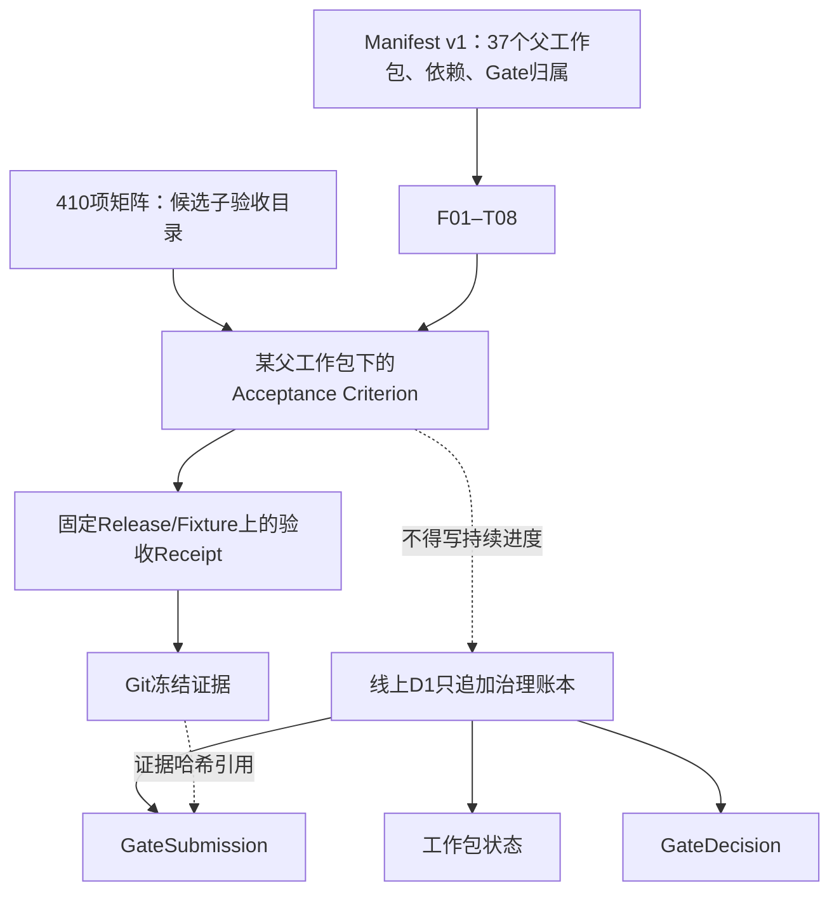
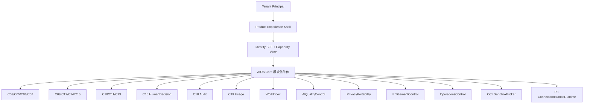

# 通用多企业 AI 员工平台：完备工程级方案 v5.3

副标题：410 项子验收治理、P0/P1 证据影响分析与 P2/P3 执行候选

日期：2026-07-27

状态：候选方案；尚未获得 Product Owner 对本文准确 SHA-256 的批准

事实截止：沿用 v5.2 已核验的线上 D1 revision 64 快照，不声称 revision 64 之后没有新事件；本次未读取或写入线上 D1

已批准历史基线：`docs/plans/通用多企业AI员工平台_完备工程级方案_v5.1.md`

已批准历史基线 SHA-256：`386a5778defc045dedf7c6b79a20e23111dde53f81485f4767a9c0ddd59e7cc0`

直接修订输入：

- `docs/plans/通用多企业AI员工平台_完备工程级方案_v5.2.md`
- SHA-256：`4561e29937b0f6315c882e74959cbc990bf84413732e8c91e542600b259f2fa8`
- `docs/plans/通用多企业AI员工平台_v5.2最小验收项与开源参考矩阵_v1.0.md`
- SHA-256：`d326404ed55b43eccdba01287793ea64812aaafa83f02596bd58b3f83ccdad7a`

37 项工作包定义基线：

- `implementation/governance/work-package-manifest.v1.json`
- SHA-256：`e1dd21cab94ae4febbeef2ad4a14b72999270e49940fc2a50a7a3aea073cdc4d`

重要边界：本文只新增一个候选计划文件，不修改 v5.1、v5.2、410 项矩阵、Manifest v1、线上 D1、任何 Gate、任何工作包状态、README 或既有冻结证据。

## 1. 执行结论

v5.3 保留 v5.2 的产品化方向，但修正其验收治理方式：

1. F01—T08 仍为唯一 37 个 Project Work Package；
2. 410 项只是 37 个工作包和 G0—G3 下面的最小子验收条件，不是工作包、Issue、Ticket、里程碑或第二套进度；
3. Manifest v1 继续定义 37 个父工作包、依赖和 Gate 归属；
4. D1 继续独占工作包状态、GateSubmission 和 GateDecision；
5. Git 冻结源码、测试、回执和验收结果；
6. 子验收可以在某个固定 Release/Fixture 上产生 `PASS/FAIL` 证据，但不得拥有 `NOT_STARTED/IN_PROGRESS/VERIFIED` 等持续进度状态；
7. P0/P1 的 176 项已逐项完成 A/B/C/D 影响分类；
8. 现有证据没有直接证明 G0 或 G1 存在实质性误判；
9. 29 个 B 类项需要补充证据，但不自动回退或清零历史状态；
10. 5 个 C 类项只对 v5.3 获批后的新 Release 生效，不追溯 G0/G1；
11. 5 个 D 类项明确推迟到 P2 或 P3，不构成历史 Gate 失败；
12. P0—P2 继续只使用 Synthetic Fixture；P3 才接受目标企业资料、Enterprise User 和 Connector Instance；
13. 开源项目和标准只作候选 Implementation、Adapter 或验收口径，不代表已经采用；
14. React Bits 等视觉项目只进入后期产品打磨，前期优先完成可用、可访问、可验证的工程前端。

### 1.1 可实现度

| 目标 | 可实现度 | 当前主要约束 |
|---|---:|---|
| 410 项作为 37 包子验收管理 | 高 | 必须禁止形成平行状态和重复工作包 |
| 补齐 P0/P1 的 29 项证据 | 高 | 需要跨进程、跨模块、CI、时限和完整 Surface 回执 |
| P2 工程化与产品化 | 高 | 密钥、供应链、microVM、恢复、72 小时、独立复核 |
| P3 首个真实 Tenant | 中高 | 企业授权、身份、知识、隐私、支持和真实责任人 |
| 第二个 Tenant 重复交付 | 中高 | 必须零 Product Core Fork，并重复独立 G3 |
| 单人 Product Owner 完成全部验收 | 低 | 安全、恢复、可用性和企业授权不能由同一人自证 |

工程上没有不可解的核心障碍。项目的主要风险不是模型能力，而是治理边界、证据完整性、独立人类复核和生产运行能力。

## 2. v5.3 相对 v5.2 的变更摘要

| # | v5.2 | v5.3 修订 |
|---|---|---|
| 1 | 410 项矩阵作为后续验收候选 | 明确为 37 个父工作包下的只读子验收目录，不创建第二套工作或进度 |
| 2 | 提议获批后生成 Manifest v1.1 候选 | Manifest v1 继续保持当前定义基线；任何未来 Manifest 修订必须另案、另批，不是自动下一步 |
| 3 | 未逐项处理 P0/P1 追溯影响 | 对 F01—F04、C01—C19 共 176 项逐项分类 A/B/C/D |
| 4 | 容易把旧 `VERIFIED` 扩大到新增细项 | A 只表示现有冻结证据直接闭合；B、C、D 均不被旧状态自动覆盖 |
| 5 | 没有集中补证计划 | 形成 26 组补充验证动作，覆盖 29 个 B 类项 |
| 6 | 新标准生效边界较散 | C 类绑定“首个引用 v5.3 获批哈希的 Release Acceptance Profile” |
| 7 | 跨阶段复合项可能被误判失败 | C13-AC08、C16-AC08、C19-AC01 等按阶段推迟，不追溯影响 G1 |
| 8 | G0/G1 原子项可能被倒推 | G0-AC01、G1-AC01 判为非追溯 C 类；其余 Gate 项只作证据映射 |
| 9 | P2 产品化范围较完整但缺影响优先级 | 先补安全和事实源证据，再按 O02→O03→{O01,O04}→O05→O06 执行 |
| 10 | React Bits 已有后期定位 | 继续后置；工程前端先通过状态、权限、可访问性、浏览器和恢复验收 |

## 3. 治理层级与权威来源



### 3.1 三类真相

| 关注点 | 唯一权威来源 | 明确禁止 |
|---|---|---|
| 37 项定义、依赖、Gate 成员 | Manifest v1 | 用矩阵增加第 38 项或改依赖 |
| 工作包状态、GateSubmission、GateDecision | 线上 D1 | 用 Markdown、Issue、标签、测试通过冒充状态 |
| 源码、测试、验收结果、Frozen Evidence | Git 冻结证据 | 用 D1 状态代替源证据 |

### 3.2 410 项允许保存什么

允许：

- 稳定子验收 ID；
- 父工作包 ID；
- 适用阶段和适用性；
- Acceptance Profile Digest；
- Release/Fixture/Tenant Scope；
- 原始证据哈希；
- 本次验收的 `PASS/FAIL/NOT_APPLICABLE` 结果；
- Reviewer 和独立性声明。

禁止：

- 为子验收保存持续 `NOT_STARTED/IN_PROGRESS/VERIFIED` 状态；
- 计算“410 项完成百分比”并替代 D1；
- 为每项创建 Issue、Ticket、项目或 `.scratch` 记录；
- 让单项 `PASS` 自动更新父工作包；
- 让新增子验收自动清零父工作包或旧 Gate；
- 让平均分掩盖零容忍失败。

### 3.3 当前历史状态保护

沿用 v5.2 对 revision 64 的已核验快照：

| 范围 | 历史事实 |
|---|---|
| P0 | F01—F04 为 4/4；G0 已批准 |
| P1 | C01—C19 为 19/19；G1 已批准；范围仅 `P1_SYNTHETIC_ONLY` |
| P2 | O01—O06 为 0/6；已开放但无完成声明 |
| P3 | T01—T08 为 0/8；受 G2 阻断 |
| 总体 | 23/37 已验证 |
| Connector | C0 Mock；真实 Connector Instance 为零 |
| 任意代码 | 关闭；O01 未验证 |
| 企业接入 | 未验证 |
| 生产就绪 | 未验证 |

本表不是当前 D1 的替代投影。开始任何状态性操作前，仍必须重新读取线上 D1。

## 4. P0/P1 影响分析

### 4.1 分类口径

| 类别 | 定义 | 历史状态处理 |
|---|---|---|
| A | 原验收要求的细化，现有冻结证据已经直接满足 | 只建立证据映射，不改状态 |
| B | 原验收要求的细化，但现有冻结证据缺精确证明 | 追加补证；不自动回退 |
| C | v5.2 或矩阵新增标准 | 非追溯；声明生效版本和阶段 |
| D | 尚未实现或应推迟到后续阶段 | 保留阶段边界；不算历史失败 |

“现有状态为 VERIFIED”不能把一项判为 A；只有源码、测试和冻结回执闭环才能判 A。

### 4.2 汇总

| 范围 | A | B | C | D | 合计 |
|---|---:|---:|---:|---:|---:|
| P0：F01—F04 | 12 | 14 | 0 | 0 | 26 |
| P1：C01—C10 | 61 | 9 | 1 | 2 | 73 |
| P1：C11—C19 | 64 | 6 | 4 | 3 | 77 |
| **P0/P1 合计** | **137** | **29** | **5** | **5** | **176** |

结论：

- 77.8% 的 P0/P1 原子项已有直接证据闭环；
- 16.5% 需要补充证据；
- 2.8% 是非追溯新增标准；
- 2.8% 明确属于后续阶段；
- 当前没有足够证据认定 G0/G1 存在实质性误判。

### 4.3 每个工作包汇总

| 工作包 | A | B | C | D | 合计 |
|---|---:|---:|---:|---:|---:|
| F01 | 3 | 3 | 0 | 0 | 6 |
| F02 | 3 | 3 | 0 | 0 | 6 |
| F03 | 3 | 4 | 0 | 0 | 7 |
| F04 | 3 | 4 | 0 | 0 | 7 |
| C01 | 5 | 2 | 0 | 0 | 7 |
| C02 | 5 | 1 | 0 | 0 | 6 |
| C03 | 7 | 0 | 0 | 0 | 7 |
| C04 | 5 | 2 | 0 | 0 | 7 |
| C05 | 5 | 1 | 0 | 0 | 6 |
| C06 | 7 | 1 | 0 | 0 | 8 |
| C07 | 8 | 0 | 0 | 1 | 9 |
| C08 | 6 | 1 | 1 | 0 | 8 |
| C09 | 5 | 1 | 0 | 1 | 7 |
| C10 | 8 | 0 | 0 | 0 | 8 |
| C11 | 6 | 1 | 0 | 0 | 7 |
| C12 | 8 | 0 | 0 | 0 | 8 |
| C13 | 6 | 1 | 0 | 1 | 8 |
| C14 | 8 | 0 | 0 | 0 | 8 |
| C15 | 8 | 1 | 1 | 0 | 10 |
| C16 | 9 | 0 | 0 | 1 | 10 |
| C17 | 5 | 1 | 3 | 0 | 9 |
| C18 | 8 | 0 | 0 | 0 | 8 |
| C19 | 6 | 2 | 0 | 1 | 9 |

## 5. 已完成项证据映射

以下只映射 A 类。包级回执是入口；具体测试和来源清单仍以回执内部哈希为准。

| 工作包 | A 类子验收 | 冻结证据入口 |
|---|---|---|
| F01 | AC01、AC02、AC05 | `implementation/p0/evidence/f01-evidence.v2.json` · `sha256:11baffbcb40eebd6496b5739798974aecb0a01cb214abe7a3c884d6e6f531f13` |
| F02 | AC01、AC02、AC06 | `implementation/p0/evidence/f02-evidence.v1.json` · `sha256:cf7255d621f7db0f88c70b0f690ced20d64294fd49aa711a8cfd1d9923797cb8` |
| F03 | AC02、AC03、AC04 | `implementation/p0/evidence/f03-evidence.v1.json` · `sha256:64aac8860a9b397860015542338ca90b2a8bd2e9381e56e53fa2ffb1dc01bcda` |
| F04 | AC02、AC03、AC06 | `implementation/p0/evidence/f04-evidence.v1.json` · `sha256:4791558978f34a3ccd15de80f05efc8beb13660227c11a4a308380ac9d100f35` |
| C01 | AC01、AC02、AC03、AC06、AC07 | `implementation/p1/c01/c01-verification-evidence.v1.json` · `sha256:569de7e468060f46a39f79a8e643d8d249703abda6f3892acc47e93325c223e5` |
| C02 | AC01、AC02、AC03、AC04、AC06 | `implementation/p1/c02/c02-verification-evidence.v1.json` · `sha256:be3562abe7ebb9fca5bdc26ff1e2cbe6899e1f144da810f116d89ddc1d8b2276` |
| C03 | AC01—AC07 | `implementation/p1/c03/c03-verification-evidence.v2.json` · `sha256:b654101c555b4e386f4c044da5bbb6884263579deb2a12425a713d189f86f30d` |
| C04 | AC01、AC03、AC05、AC06、AC07 | `implementation/p1/c04/c04-verification-evidence.v1.json` · `sha256:554df39362987342eaab88b5146b04a70bc3db8b566a81c6af5b1866816063de` |
| C05 | AC01、AC02、AC03、AC04、AC06 | `implementation/p1/c05/c05-verification-evidence.v1.json` · `sha256:f0a10441493363f82d9301720b0e59266a6e76c4db7dc18b896625a72e2049b2` |
| C06 | AC01—AC07 | `implementation/p1/c06/c06-verification-evidence.v3.json` · `sha256:b80fe8d28b8c4b2ea8caa33f6685af0ab1c00b7f127b736600cd5e82feef83de` |
| C07 | AC01、AC02、AC03、AC05—AC09 | `implementation/p1/c07/c07-verification-evidence.v1.json` · `sha256:0d9b53b93966859a91fc3f7a8cf73d0ded84d3760cd5d46c3d3696e4424ceeb3` |
| C08 | AC01—AC05、AC07 | `implementation/p1/c08/c08-verification-evidence.v1.json` · `sha256:677cc01ea7fb33acdec0bdca5f6b57ff4f75818e23cb2309bdec9611a7135382` |
| C09 | AC01—AC05 | `implementation/p1/c09/c09-verification-evidence.v1.json` · `sha256:219797bbd0ee758ece970cff54e8befb56adf42484859fbdda17f83d200dee1d` |
| C10 | AC01—AC08 | `implementation/p1/c10/c10-verification-evidence.v1.json` · `sha256:e1e1952e4e16ebf5dafd329f707a940bfd806a6c0e3c72d23b8caa46a879790f` |
| C11 | AC01、AC02、AC03、AC05、AC06、AC07 | `implementation/p1/c11/c11-verification-evidence.v1.json` · `sha256:d87b56f495ba30cdbd8cbe8e26f388222d8a11c325dfed4fb7599833f6d1e93f` |
| C12 | AC01—AC08 | `implementation/p1/c12/c12-verification-evidence.v1.json` · `sha256:6d0476de664e0f85feaadce045f57794d93fc4fbd8642f3c8e5f271690919d9a` |
| C13 | AC01、AC03—AC07 | `implementation/p1/c13/c13-verification-evidence.v1.json` · `sha256:204bc13331e1aad91042771ae49575c5fd762bb9ad4d40187e9a7598c49b56ae` |
| C14 | AC01—AC08 | `implementation/p1/c14/c14-verification-evidence.v1.json` · `sha256:35a0495c11b291e93ea59f2db91a507165a80e27f9beae3d7ccd5c2e81d31f0f` |
| C15 | AC01、AC03、AC04、AC06—AC10 | `implementation/p1/c15/c15-verification-evidence.v2.json` · `sha256:9b53f2dcc84ef5e70c960e5d30b8e5ab2ec4b4617d8a39a52ec9ef426bf8ac33` |
| C16 | AC01—AC07、AC09、AC10 | `implementation/p1/c16/c16-verification-evidence.v1.json` · `sha256:74e8e3550df3dc0c2d686e97915b3613f4a593b5b1b908ce4edd76dc2707ffca` |
| C17 | AC01、AC03、AC04、AC06、AC07 | `implementation/p1/c17/c17-verification-evidence.v1.json` · `sha256:f97be8858412ffefd27fdae2ea60d9ac03e30dd2b6f25cd0184b76ae2dd7a2f0` |
| C18 | AC01—AC08 | `implementation/p1/c18/c18-verification-evidence.v1.json` · `sha256:596561457d2e8458036beec98a552811410e225ef4926f0b91236e57c08d8751` |
| C19 | AC02—AC07 | `implementation/p1/c19/c19-verification-evidence.v3.json` · `sha256:b87dfbec0d3fc753b62b2e603f9570c2b405af65577045a317cc5ce0a64ebff2` |

P1 的正式包级索引仍为：

`implementation/gates/g1/p1-module-evidence-index.v1.json`

单个工作包回执和测试通过不单独构成 G1 Stage Approval；历史 G1 Decision 仍只以 D1 为准。

## 6. 待补证据清单

以下 26 组验证覆盖 29 个 B 类项。它们是静态补证动作，不是新工作包，也不保存独立进度。

### 6.1 P0 补证

| 编号 | 覆盖项 | 最小补证动作 |
|---|---|---|
| P0-B01 | F01-AC03 | 对乱序对象、嵌套对象和数组边界冻结 canonical bytes 与 SHA-256 等价回执 |
| P0-B02 | F01-AC04 | 三个独立进程重复计算同一冻结包并冻结环境与摘要 |
| P0-B03 | F01-AC06 | 分别证明 Manifest 不能冒充 D1、D1 不能改定义、未引用 Git 文件不能令包 VERIFIED |
| P0-B04 | F02-AC03、AC04、AC05；F04-AC05 | 对源码、Fixture、评测、运行库、日志、Trace、发布包等保护 Surface 做水印、企业标识、Token、私钥、连接串 Canary 和 CI 阻断 |
| P0-B05 | F03-AC01 | 锁定准确 JSON Schema 2020-12 校验器，执行编译、正例和逐关键字负例 |
| P0-B06 | F03-AC05 | 生成一个 Consumer 和 Provider，只依赖冻结契约完成 Synthetic 集成 |
| P0-B07 | F03-AC06 | 为路径、操作、响应、属性、必填、类型、枚举、引用分别执行 breaking mutation 并阻断 CI |
| P0-B08 | F03-AC07 | 用验证专用 deprecated 样例证明版本、替代路径、公告日和停止日闭包 |
| P0-B09 | F04-AC01 | 冻结架构—资产—边界—数据流—威胁—测试案例交叉表，未映射为零 |
| P0-B10 | F04-AC04 | 分别执行对象篡改、过期决定、直接 API、旧 Digest 重用并证明零副作用 |
| P0-B11 | F04-AC07 | 追加引用既有 D1 人工基线事件、候选哈希、G0 Submission Hash 和 Adjudication 摘要；禁止改旧证据 |

### 6.2 P1 C01—C10 补证

| 编号 | 覆盖项 | 最小补证动作 |
|---|---|---|
| P1-B01 | C01-AC04 | 取消、服务端超时、客户端断线三类 E2E；无假成功、无后续 Tool/Connector 副作用 |
| P1-B02 | C01-AC05 | C01→C11→C10 引用逐字段对账；撤回、删除、无权限时显示不可用 |
| P1-B03 | C02-AC05 | Synthetic 高风险管理命令串联确认消费、Core receipt、真实 C18 event 和不可变回读 |
| P1-B04 | C04-AC02 | 重复/乱序 SCIM Create/Update/Delete 贯穿 C04→C05，只保留一个活动 IdentityLink |
| P1-B05 | C04-AC04 | 冻结停用 SLA，记录提交时间和最后允许时间，跨 BFF/Core/Session Cache 验证 |
| P1-B06 | C05-AC05 | 生成受保护 Operation→Action Identity→C08/C15/C18 覆盖表，差异为零 |
| P1-B07 | C06-AC08 | 冻结撤权 SLA，遍历全部 PEP 和缓存，旧 Allow 不能提交 |
| P1-B08 | C08-AC08 | 修改 Synthetic 权威源版本，证明 C08 只存引用/版本/回读证据且能识别陈旧引用 |
| P1-B09 | C09-AC06 | 冻结个人记忆数据面；主库、Checkpoint、向量、缓存、恢复副本删除命中为零 |

### 6.3 P1 C11—C19 补证

| 编号 | 覆盖项 | 最小补证动作 |
|---|---|---|
| P1-B10 | C11-AC04 | 在冻结查询集上定义 Recall/Precision 公式、分母、阈值和原始结果；不能只用四个案例“看起来正确” |
| P1-B11 | C13-AC02 | 冻结真实受保护 Git 评审/CODEOWNERS 证据，证明未批准提交不能发布；本地 review fixture 不足以代替托管保护 |
| P1-B12 | C15-AC05 | 参数化字段、收件人、附件、规则、Skill 和相关版本；任一变化使旧决定失效 |
| P1-B13 | C17-AC05 | 增加乱序响应/事件负例，并与 Schema 注入、重放和超时形成一份可靠性回执 |
| P1-B14 | C19-AC08 | 冻结 Synthetic Provider/基础设施账单输入、差异公式和阈值，逐账单对账 |
| P1-B15 | C19-AC09 | 对项目进度、发票、企业 BI 指标三类非法真相写入做 Schema/API/数据库负例 |

### 6.4 补证执行规则

1. 先查找是否已有未被索引的冻结证据；
2. 没有时再补最小测试或回执；
3. 补证只写入所属父工作包或 G2 回归证据目录；
4. 补证成功不新增 D1 状态；
5. 补证发现行为错误时，先在父工作包范围内整改并产生新 Git 证据；
6. 只有错误足以推翻原 Gate 的核心前提时，才提出追加式 Gate 复核；
7. 不删除、覆盖或改写旧 Submission、Decision 或证据。

## 7. 新增范围清单

### 7.1 P0/P1 的 C 类

C 类拟从“首个 Acceptance Profile 明确引用 v5.3 获批准确哈希的 Product Release”开始生效。批准 v5.3 本身不代表这些项已实现。

| 子验收 | 新标准 | 拟生效阶段 | 父包/协同包 | 不追溯范围 |
|---|---|---|---|---|
| C08-AC06 | 把 Connector 副作用也纳入重试去重闭环 | P2 用 C0 Synthetic；P3 用真实 Connector | C08；C17、O04/O06、T04—T07 | 不追溯 G1 的 Tool Mock 结论 |
| C15-AC02 | 审批 UI 展示完整对象、差异、来源和风险 | P2 O04/O06 | C15；Product Experience Shell | 不追溯 C15 状态机证据 |
| C17-AC02 | 独立开发者可从空项目生成并验证最小 Adapter | P2 O04-PX07/O06-Q07 | C17；O03/O04/O06 | 不追溯 C17 Mock SDK 合同 |
| C17-AC08 | OpenAPI、错误、版本、弃用文档可独立执行 | P2 O03/O04/O06 | F03/C17 | 不追溯 G1 结构兼容 |
| C17-AC09 | Webhook 签名、重放窗口、密钥轮换正反例 | P2 O02/O03/O04；只在 Release 暴露 Webhook 时 REQUIRED | C17；O02/O03/O04 | 未暴露 Webhook 时只能正式 N/A，不能假 PASS |

### 7.2 D 类后续范围

| 子验收 | 当前已证明 | 推迟内容 | 阶段 |
|---|---|---|---|
| C07-AC04 | 本地文件 Adapter 的 Tenant 路径和跨 Tenant 拒绝 | S3-compatible Bucket/Prefix Policy、签名 URL | P2 O04/O05；P3 Tenant 配置 |
| C09-AC07 | Synthetic expiry、scrub 和 fresh restore | 生产备份保留窗口、法律/合同例外、到期销毁 | P2 O05；P3 T01/T08 |
| C13-AC08 | P1 任意 Skill 脚本关闭 | 未签名 OCI/SBOM/制品准入拒绝 | P2 O03/O01 |
| C16-AC08 | P1 短期 Synthetic capability 且零泄漏 | 生产动态凭据、租约、模型上下文零泄漏 | P2 O02；P3 Connector |
| C19-AC01 | C14→C16→C18→C19 Synthetic Trace | Portal/Core/Model/Tool/Sandbox 全链 Trace | P2 O01/O06 |

D 表示“未到适用阶段”，不是 `FAIL`。

### 7.3 其余 234 项的治理位置

| 范围 | 数量 | v5.3 处理 |
|---|---:|---|
| G0/G1 | 13 | 历史影响保护；见第 8 节 |
| P2：O01—O06 | 91 | 未来 G2 子验收候选，不产生当前状态 |
| P3：T01—T08 | 100 | 未来单 Tenant G3 子验收；只在 P3 使用企业资料 |
| G2/G3 | 30 | 未来 Gate 条件候选；必须绑定准确 Submission Hash |

P2 91 项分布：O01 10、O02 10、O03 12、O04 21、O05 14、O06 24。

P3 100 项分布：T01 16、T02 10、T03 12、T04 10、T05 10、T06 10、T07 14、T08 18。

这些数字只是目录覆盖，不是完成率。

## 8. G0/G1 影响与复核规则

### 8.1 G0/G1 子验收分类

| Gate 子验收 | 分类 | 判断 |
|---|---|---|
| G0-AC01 | C | “F01—F04 全部新原子项通过”是矩阵新增总括条件，不追溯旧 G0 |
| G0-AC02—AC06 | A | 定义闭包、Synthetic 边界、零企业数据、冻结包和哈希决定已有证据 |
| G1-AC01 | C | “C01—C19 全部 150 项通过”是矩阵新增总括条件，不追溯旧 G1 |
| G1-AC02—AC07 | A | 三 Tenant、隔离、完整旅程、零副作用、代码关闭/C0 和哈希决定已有 G1 证据 |

### 8.2 当前判断

目前没有足够证据认定 G0 或 G1 存在实质性误判：

- B 类主要缺少更精确的跨进程、跨模块、CI、计时或 Surface 闭包；
- C 类明确是新增标准；
- D 类与 G1 已记录的阶段限制一致；
- 尚未发现现有冻结证据明确证明安全或语义要求失败。

### 8.3 复核触发条件

只有出现以下任一情况才提出正式复核建议：

1. B 类补证实际失败；
2. 源码或冻结回执与原 Gate 声明直接矛盾；
3. 原 Gate 所依赖的人工确认事件或准确哈希不存在；
4. 已发现跨 Tenant 泄露、越权、审批绕过、企业数据提前进入或真实外部副作用。

触发后只允许：

- 追加复核事件；
- 新建整改证据；
- 新建 supersedes 关系；
- 对新的准确 Submission 作新决定。

禁止删除、覆盖、回写或伪造历史记录。

## 9. v5.3 产品架构

v5.2 的模块化单体方向保持不变。v5.3 进一步把子验收绑定到 Module Interface，而不是绑定到 UI 或某个开源产品。



### 9.1 深模块与 Interface

| Module | 最小 Interface | 隐藏复杂度 | 不拥有 |
|---|---|---|---|
| Product Experience Shell | `GetNavigation`、`GetViewModel`、`SubmitIntent` | 页面、状态、响应式、可访问性 | 权限、HumanDecision、审计 |
| WorkInbox | `ListWork`、`GetWork`、`ActOnWork` | 待办、失败、超时、恢复投影 | C08/C15 状态真相 |
| AssetReleaseFacade | `CreateDraft`、`ValidateDraft`、`SubmitForReview`、`PublishApproved`、`Rollback` | Knowledge/Agent/Skill 的不同 Schema 与发布链 | C10/C12/C13 Registry 真相 |
| AIQualityControl | `Evaluate`、`RecordFeedback`、`CheckRelease` | Dataset、指标、候选对照、裁决、漂移 | C18 审计、C08 Run |
| PrivacyPortability | `PlanExport`、`BuildExport`、`VerifyImport`、`ExecuteDeletion` | 数据面、引用闭包、保留例外 | 企业法律意见 |
| ProductTelemetry | `RecordProductEvent`、`QueryAggregate` | 事件字典、聚合、保留和禁止字段 | C19 技术用量、企业 BI |
| EntitlementControl | `CheckEntitlement`、`RecordMeteredUsage` | 能力、配额和支持等级 | 发票、会计、合同 |
| OperationsControl | `GetServiceStatus`、`DeclareIncident`、`ExecuteRunbook`、`CloseIncident` | 告警、事故、运行手册和恢复回执 | D1、HumanDecision |

只有出现两个真实可替换 Implementation 时才冻结 Adapter Seam。不能为了“未来可能更换”先制造一层空抽象。

### 9.2 关键权力边界

- Product Owner 只管理 Product Phase、范围和 Stage Approval；
- Product Owner 不是 Target Enterprise 员工，不自动获得 Tenant 权限；
- Runtime Authorization 来自目标企业；
- HumanDecision 只能由当前获授权 Human Tenant Principal 作出；
- D1 不保存 Tenant 业务任务；
- C08/C15 不保存项目工作包状态；
- UI、Prompt、Skill、MCP、套餐和模型输出均不能扩大权限；
- Connector Stage 不能由全局进度按钮推进。

## 10. P2 工程执行方案

正式顺序保持：

```text
O02
→ O03
→ O01 与 O04 并行
→ O05
→ O06
→ G2
```

### 10.1 O02：密钥、短期凭据与工作负载身份

最低结果：

- Root Token 和长期 Provider Key 不进入应用；
- 动态凭据有最小 Scope、TTL、撤销和审计；
- 工作负载身份不能冒充 Enterprise User 或 HumanDecision；
- Break-glass 有独立批准、时限、撤销和完整审计；
- 覆盖 C16-AC08 的生产凭据部分。

### 10.2 O03：软件供应链与制品信任

最低结果：

- 镜像、前端、Skill 和依赖全部固定 Digest；
- Provenance、SBOM、签名、漏洞和许可证证据闭合；
- 未签名、Digest 不符或缺材料的制品被准入拒绝；
- 未采用候选不进入依赖锁或发行物；
- React Bits、AGPL、自定义许可证和 Commons Clause 等按准确版本、目录和交付方式复核；
- 覆盖 C13-AC08 的 P2 制品部分。

### 10.3 O01：Sandbox Broker

最低结果：

- 一任务一短生命周期 microVM；
- 默认断网；
- CPU、内存、磁盘、进程和时间硬限制；
- 无宿主机、Docker Socket、设备或残留访问；
- 短期工作负载身份；
- 超时、失联和 Kill Switch 触发 Reaper；
- Sandbox 不能正式 Commit 或绕过 C15/T07；
- 为 C19-AC01 提供真实 P2 Sandbox Trace。

### 10.4 O04：部署、回滚与产品化交付

O04 继续承担：

- 空环境安装、重复安装、升级和回滚；
- Role/Journey/IA；
- 工程前端和完整页面状态；
- WorkInbox；
- AssetReleaseFacade；
- PrivacyPortability；
- 文档和开发者入口；
- Event/Entitlement Dictionary；
- Tenant-scoped Connector/G3 控制面修正；
- D1 计划基线投影修正。

前端优先顺序：

1. 服务端授权和 Capability；
2. 加载、空、拒绝、失败、超时、部分成功、重试、人工、降级、恢复、成功状态；
3. 键盘、焦点、语义和读屏；
4. Chrome/Edge/Safari 与视口矩阵；
5. 视觉一致性和回归；
6. 最后才是 React Bits 等动效打磨。

### 10.5 O05：高可用、恢复与可移植性

最低结果：

- 数据库、对象、制品、配置和必要密钥材料进入备份范围；
- 随机恢复点实际恢复；
- RPO/RTO 实测；
- 恢复后隔离、授权、C18 哈希链和删除语义仍成立；
- Synthetic Tenant 全资产导出、校验、引用闭包、重建和损坏拒绝；
- I1/I2/I3 分档恢复；
- 覆盖 C07-AC04、C09-AC07 的 P2 部分。

### 10.6 O06：SLO、容量、混沌和产品质量发布门

最低结果：

- 2 倍目标峰值持续 60 分钟；
- 目标持续负载 72 小时；
- Core API 与用户端到端指标分开；
- J01—J10 的正常、拒绝、失败和恢复路径；
- 至少 6 名独立参与者、至少 30 次预设任务、成功率不低于 80%，高风险错误成功为零；
- 键盘可完成、axe Critical/Serious 为零、人工读屏复核；
- 冻结 Chrome、Edge、Safari 准确版本及前一主要版本；
- 1440×900、1024×768、390×844 视口；
- 请求 durable acknowledgement 或明确拒绝 p95 不超过 1 秒；
- 取消 2 秒内被服务端接受，并证明零后续副作用；
- Model/RAG/Tool/Notification 故障不越权、不改政策、不假成功；
- AI Dataset/Metric/Model/Prompt/Skill/Knowledge/Adjudication 完整绑定；
- ASVS L2、SAST、DAST、授权负例和漏洞闭环；
- 五类事故演练；
- Product Event Canary 泄露为零；
- 文档和可移植性可由未参与实现者独立执行。

所有阈值必须在首次采证前冻结，不能看到结果后放宽。

## 11. P3 企业接入方案

P3 才允许：

- 目标企业内部资料；
- 真实 Enterprise User；
- 真实 IdP/SCIM；
- 真实知识与 Skills；
- 真实 Connector Instance；
- 企业 Data Policy Pack；
- 真实培训、支持、价值和退出验证。

### 11.1 首个 Tenant

1. T01 冻结企业授权、Onboarding Package、Data Policy Pack、Isolation Profile 和 RACI；
2. T02 接入身份、组织和账号生命周期；
3. T03 只在 REQUIRED 时接入真实知识和 3—5 个 Skills；
4. OA 不可接时 T04 可预先冻结为 `NOT_IN_SCOPE`；
5. ERP/U9 不可接时 T05 可预先冻结为 `NOT_IN_SCOPE`；
6. BI 不可接时 T06 可预先冻结为 `NOT_IN_SCOPE`；
7. T07 默认 `NOT_IN_SCOPE`，除非企业明确授权 C3；
8. T08 验证真实用户、浏览器、支持、质量、回滚、导出和退出演练；
9. G3 只接受该 Tenant 的准确 Submission；
10. 未接入能力不得在页面、文档或销售表述中宣称已接入。

### 11.2 第二个 Tenant

只有第二个独立 Tenant：

- 使用同一 Product Core Release；
- 不 Fork Product Core；
- 独立完成 T01—T08 的适用范围；
- 独立通过 G3；

才允许声明“多企业重复交付已被验证”。

## 12. 开源与标准采用规则

矩阵中的 R01—R43 全部只是候选参考。

任何项目进入 Release Digest 前必须：

1. 有哈希化、可量化的能力缺口；
2. 固定源码版本、镜像 Digest、实际使用目录和数据流；
3. 核对许可证、品牌、再分发和商业边界；
4. 形成 ADR，写明默认、替代、退出和迁移；
5. 使用 Synthetic Fixture 做 PoC、故障、隔离和回滚；
6. 明确 Owner、值班、升级、备份、成本和停止维护方案；
7. 通过 O03 的 SBOM、Provenance、签名和准入；
8. 不形成双授权、双工作流、双通知、双评测或双计量真相。

默认最小组合仍是：

| 能力 | 默认方向 | 候选参考 |
|---|---|---|
| 前端 | 现有 Next.js/React/Tailwind | shadcn/ui；React Bits 后期 |
| 身份 | 现有 Interface + Synthetic IdP | Keycloak |
| 授权 | C06 Interface | OpenFGA/OPA |
| 状态与任务 | PostgreSQL Outbox | pg-boss；Temporal 条件后置 |
| AI 评测 | 现有确定性 Runner | promptfoo/Langfuse 通过采用门后 |
| 沙箱 | O01 SandboxBroker Interface | Kata/Firecracker/gVisor |
| 密钥 | O02 Interface | OpenBao/SPIRE |
| 可观测 | OpenTelemetry 语义 | Prometheus/Grafana |
| 文档 | 仓库 Markdown + 可执行示例 | Docusaurus/Scalar |
| 产品分析 | 最小 Event Dictionary | Matomo/PostHog 通过隐私门后 |
| 通知 | 内建站内 WorkInbox | Novu 仅作 Delivery Adapter |

## 13. 测试与证据结构

### 13.1 测试层

| 层 | 主要对象 | 必需证据 |
|---|---|---|
| Schema | Role、Route、Event、Entitlement、Export | 固定版本、正例、负例 |
| 单元/属性 | 哈希、幂等、乱序、过期、篡改 | 原始测试结果 |
| 契约 | Portal/BFF/Core/Model/Tool/Connector | Consumer/Provider |
| 授权 | 页面、API、下载、Tool、Sandbox | Allow/Deny 和绕过负例 |
| 隔离 | SQL、向量、对象、搜索、缓存、恢复 | 全 Surface 有向矩阵 |
| UI | 页面状态、视口、浏览器、视觉 | E2E 和截图索引 |
| 可访问性 | 键盘、焦点、语义、读屏 | 自动与人工回执 |
| AI 质量 | Dataset、版本、指标、裁决 | Evaluation Receipt |
| 性能 | API、用户旅程、Provider 分段 | p50/p95/p99 |
| 安全 | ASVS、SAST、DAST、依赖、镜像、IaC | 发现、修复、复测 |
| 隐私 | Event、导出、删除、Manager 可见性 | Canary 和传播证明 |
| 运维 | 告警、事故、Runbook、恢复 | 时间线和复盘 |
| 文档 | 安装、操作、调试、回滚 | 独立执行回执 |

### 13.2 Receipt 最小字段

```text
receipt_id
parent_work_package_id
criterion_ids
product_release_digest
acceptance_profile_digest
fixture_or_tenant_scope
started_at
completed_at
tool_versions
raw_evidence_hashes
result
findings
exceptions
reviewer_identity
independence_statement
```

Receipt 不得包含子验收持续进度字段。

## 14. 人员与独立复核

Product Owner 可以：

- 批准方案、范围、资源和 Gate；
- 组织内部或外部工程人员；
- 决定候选工具是否进入评估；
- 对准确 Submission Hash 作 Stage Approval。

Product Owner 不能替代：

- 独立安全复核人；
- 独立恢复复核人；
- 独立可用性参与者；
- 目标企业授权接入人；
- Tenant Runtime Authorization；
- HumanDecision；
- 企业隐私、数据、退出和业务动作授权。

建议 P2 最小团队：

- 产品/UX：1—2；
- 前端：2；
- Core/平台：2—3；
- 安全/身份/供应链：1—2；
- SRE/数据库/恢复：1—2；
- AI 质量：1；
- QA/可访问性：1；
- 文档/支持：明确 Owner，可由上述角色兼任。

单人 Product Owner + AI + 零散外包预计 P2 为 12—20+ 个月；8—12 人跨职能团队预计 5—8 个月。该估计不是承诺，Acceptance Profile 冻结后再校准。

## 15. 主要风险与 No-Go

1. 不修改 v5.1、v5.2、Manifest v1 或历史 Gate。
2. 不增加第 38 个工作包。
3. 不计算 410 项持续完成率。
4. 不用旧 `VERIFIED` 自动覆盖 B/C/D。
5. 不用 B 类补证自动回退历史状态。
6. 不在 P0—P2 使用真实、脱敏或匿名化企业内部资料。
7. 不把 Synthetic Tenant 升级为 Enterprise Tenant。
8. 不让 Product Owner 推进 Tenant Connector Stage。
9. 不让 UI、Prompt、Skill、MCP 或套餐扩大权限。
10. 不让 WorkInbox、通知、Langfuse、PostHog 或日志成为业务真相。
11. 不把 C19 当发票、会计或企业 BI。
12. 不在应用服务器执行不可信代码。
13. 不用浏览器抓取、生产库直连或万能账号绕过 OA/ERP/BI。
14. 不用 AI 自评代替独立人类安全、恢复和可用性验收。
15. 不把 React Bits 或其他视觉候选提前塞入工程关键路径。
16. 不把首个 G3 宣称为多企业重复交付。

## 16. 建议继续执行顺序

### 第 0 步：Product Owner 审阅 v5.3 候选

- 只审阅本文的范围、A/B/C/D 判定和执行顺序；
- 未批准前不写 D1；
- 若批准，只对本文准确 SHA-256 追加计划基线批准，不改变 37 项状态或 Gate。

### 第 1 步：补证查重

- 在 Git 冻结证据中查找 26 组补证是否已有未索引回执；
- 只补不存在的证据；
- 优先 P0-B03、P0-B04、P0-B11、P1-B03、P1-B05、P1-B07、P1-B09、P1-B12。

### 第 2 步：完成 B 类补证

- 在当前 Synthetic 范围执行；
- 绑定准确源码 Commit、Fixture Digest 和工具版本；
- 不改变 D1 状态；
- 若发现实质错误，先整改，再决定是否建议追加 Gate 复核。

### 第 3 步：冻结 P2 Acceptance Profile

- 引用 v5.3 获批准确哈希；
- 声明 91 个 P2 子验收的 Owner、适用性、阈值和 Receipt Schema；
- 修正跨阶段复合项的适用语义；
- 不创建新的 Manifest 或工作包。

### 第 4 步：执行 O02

完成密钥、动态凭据、工作负载身份、Break-glass 和恢复证据。

### 第 5 步：执行 O03

完成 Digest、SBOM、Provenance、签名、漏洞、许可证和准入。

### 第 6 步：并行执行 O01 与 O04

- O01 完成 microVM 隔离；
- O04 完成部署、回滚、工程前端、WorkInbox、发布工作台、文档和控制面修正；
- React Bits 不进入本阶段必选。

### 第 7 步：执行 O05

完成全栈恢复、RPO/RTO、Tenant 导出、重建和删除传播。

### 第 8 步：执行 O06

完成 72 小时、2 倍峰值、用户旅程、可用性、可访问性、AI 质量、AppSec、隐私、事故和文档门。

### 第 9 步：提交 G2

- 冻结同一 Release Digest；
- 独立复核关键证据；
- Product Owner 只对准确 G2 Submission Hash 作决定。

### 第 10 步：进入 P3

- 先 T01，再执行适用的 T02—T08；
- OA/ERP/U9/BI 可预先冻结为 `NOT_IN_SCOPE`；
- 首个和第二个 Tenant 分别独立通过 G3。

## 17. v5.3 候选验收条件

本文只有同时满足以下条件才适合提交 Product Owner：

- 37 个工作包 ID、阶段、依赖和 Gate 不变；
- 410 项被明确限定为子验收，不形成第二状态；
- Manifest v1、D1、Git 三类权威边界明确；
- 176 个 P0/P1 ID 各出现一次且只有一个 A/B/C/D 分类；
- 分类汇总为 A137、B29、C5、D5；
- B 类均有补证动作；
- C 类均有生效版本和阶段；
- D 类均有推迟阶段；
- G0/G1 不因新增原子项自动回退；
- 只在发现实质矛盾时建议追加式复核；
- P0—P2 Synthetic、P3 Enterprise 边界不变；
- 开源参考不被写成已采用；
- React Bits 明确后置；
- 不修改任何受保护对象。

本文被批准后，只代表“v5.3 计划和验收影响处理方式获批”，不代表任一 B/C/D 项完成，不代表 O02—O06 完成，不代表 G2、P3 或生产通过。

## 附录 A：P0/P1 176 项逐项分类

下表中的证据入口见第 5 节；B/C/D 的具体动作见第 6、7 节。

### A.1 P0

| ID | 分类 | 依据或处理 |
|---|---|---|
| F01-AC01 | A | 领域词典和 ADR 已直接分离三类决定 |
| F01-AC02 | A | 阶段入口、出口、依赖可机器判定 |
| F01-AC03 | B | 有 canonicalize，实现缺规范化字节等价回执；P0-B01 |
| F01-AC04 | B | 有双实例稳定哈希，缺三次跨进程回执；P0-B02 |
| F01-AC05 | A | Decision 精确绑定 Submission 哈希且不可重复决定 |
| F01-AC06 | B | 权威边界已定义，缺三类互相冒充负例；P0-B03 |
| F02-AC01 | A | 三个固定种子可重复生成 |
| F02-AC02 | A | 用户、组织、权限、知识、流程引用闭合 |
| F02-AC03 | B | Fixture 水印已证，缺全部保护 Surface；P0-B04 |
| F02-AC04 | B | 标识扫描会阻断，缺正式 CI 构建阻断；P0-B04 |
| F02-AC05 | B | 凭据负例会阻断，缺正式 CI 和全 Surface；P0-B04 |
| F02-AC06 | A | Public Context Registry 独立且发行包含时阻断 |
| F03-AC01 | B | Schema 已冻结，缺固定标准校验器回执；P0-B05 |
| F03-AC02 | A | 六类最小契约齐全 |
| F03-AC03 | A | CloudEvents Profile 正反例已验证 |
| F03-AC04 | A | Problem Details 和秘密/堆栈/路径拒绝已验证 |
| F03-AC05 | B | 有 Mock/矩阵，缺纯契约 Consumer/Provider；P0-B06 |
| F03-AC06 | B | 有 breaking checker，缺全类别 mutation 和 CI；P0-B07 |
| F03-AC07 | B | 有弃用矩阵，缺完整 deprecated 正反例；P0-B08 |
| F04-AC01 | B | 威胁模型已登记，缺架构完整性对账；P0-B09 |
| F04-AC02 | A | 跨 Tenant 一次命中即阻断 |
| F04-AC03 | A | 服务端越权一次命中即阻断 |
| F04-AC04 | B | 零容忍语义已有，缺四类绕过专项回执；P0-B10 |
| F04-AC05 | B | 零企业数据规则已有，缺全 Surface 回执；P0-B04 |
| F04-AC06 | A | 固定版本/种子可重复运行 |
| F04-AC07 | B | 阈值存在，需补 D1 人工基线引用和裁决摘要；P0-B11 |

### A.2 P1 C01—C10

| ID | 分类 | 依据或处理 |
|---|---|---|
| C01-AC01 | A | 服务端可信身份上下文已验证 |
| C01-AC02 | A | 绕过两个 UI 仍经 BFF/C06 |
| C01-AC03 | A | 文件只返回 Tenant/Principal 绑定 Quarantine 引用 |
| C01-AC04 | B | 缺取消、超时、断线完整 E2E；P1-B01 |
| C01-AC05 | B | 缺 C01→C11→C10 位置对账和失效显示；P1-B02 |
| C01-AC06 | A | 两个 Portal Renderer 共用 BFF 且不迁移权威 |
| C01-AC07 | A | P1 只使用 Synthetic Principal/Fixture |
| C02-AC01 | A | 每个管理命令服务端重鉴权 |
| C02-AC02 | A | 私人会话、记忆和草稿默认不可读 |
| C02-AC03 | A | 管理员不能更新或删除历史审计 |
| C02-AC04 | A | UI 只显示 Core 权威投影 |
| C02-AC05 | B | 缺 C02 变更到实际 C18 记录的闭环；P1-B03 |
| C02-AC06 | A | 菜单、路由和客户端动作不能扩大能力 |
| C03-AC01 | A | 并发重试只创建一个 Tenant |
| C03-AC02 | A | Provisioning 失败不能进入 ACTIVE |
| C03-AC03 | A | tenant_kind 创建后不可变 |
| C03-AC04 | A | Synthetic/Enterprise Namespace 分离且不可复用 |
| C03-AC05 | A | 暂停后新请求拒绝 |
| C03-AC06 | A | Outbox/Reconciler 崩溃、乱序、重放可收敛 |
| C03-AC07 | A | 分层删除状态和 C07 数据面清空可查询 |
| C04-AC01 | A | OIDC issuer/audience/signature/nonce/redirect 已验证 |
| C04-AC02 | B | 缺 SCIM→C05 IdentityLink 组合幂等；P1-B04 |
| C04-AC03 | A | 乱序事件不能恢复终止账号 |
| C04-AC04 | B | 会话失效已证，缺冻结 SLA 计时；P1-B05 |
| C04-AC05 | A | 同名/邮箱不自动合并 |
| C04-AC06 | A | Authentication 不自动授予业务权限 |
| C04-AC07 | A | P1 只连接 Synthetic IdP/SCIM |
| C05-AC01 | A | 外部身份变化时 principal_id 稳定 |
| C05-AC02 | A | 活动 IdentityLink 唯一 |
| C05-AC03 | A | 不跨 Tenant/IdP 按邮箱合并 |
| C05-AC04 | A | Human/Agent/Service 类型闭合 |
| C05-AC05 | B | 动作链存在，缺全部 Operation 覆盖闭包；P1-B06 |
| C05-AC06 | A | 停用传播到委托和会话 |
| C06-AC01 | A | 六类 PEP 路径登记 |
| C06-AC02 | A | 每路径有正交 Allow/Deny |
| C06-AC03 | A | 客户端/Prompt/Skill/MCP 不能改授权 |
| C06-AC04 | A | 决定绑定模型和策略版本 |
| C06-AC05 | A | PDP 故障高敏路径失败关闭 |
| C06-AC06 | A | 历史决定可按原模型和输入重放 |
| C06-AC07 | A | 策略失败可回滚 |
| C06-AC08 | B | 撤权行为已有，缺全部 PEP 的 SLA 计时；P1-B07 |
| C07-AC01 | A | 全存储面跨 Tenant 泄露为零 |
| C07-AC02 | A | FORCE RLS 且运行角色无 BYPASSRLS |
| C07-AC03 | A | 检索过滤来自服务端可信上下文 |
| C07-AC04 | D | 本地文件已证；S3 Policy/签名 URL 推迟 O04/O05 |
| C07-AC05 | A | Cache Key 隔离且命中后重鉴权 |
| C07-AC06 | A | 连接池复用不残留 Tenant 上下文 |
| C07-AC07 | A | 恢复后重跑隔离矩阵 |
| C07-AC08 | A | 删除传播期间不能重新进入检索/缓存 |
| C07-AC09 | A | Tenant 停用后数据面拒绝新访问 |
| C08-AC01 | A | 核心对象绑定 Tenant 与 Stable Principal |
| C08-AC02 | A | Run 可还原版本闭包 |
| C08-AC03 | A | 状态和 Outbox 同事务 |
| C08-AC04 | A | 命令幂等且摘要冲突拒绝 |
| C08-AC05 | A | 崩溃重放收敛 |
| C08-AC06 | C | Tool 已证；Connector 副作用标准自 v5.3 后生效 |
| C08-AC07 | A | 聊天正文不能成为正式状态 |
| C08-AC08 | B | 事实引用边界已有，缺源事实变更专项对账；P1-B08 |
| C09-AC01 | A | Candidate Memory 不参与召回 |
| C09-AC02 | A | 只有本人确认后生效 |
| C09-AC03 | A | 纠正产生新版本且旧值不召回 |
| C09-AC04 | A | 四维过滤后召回 |
| C09-AC05 | A | 禁止企业事实和 KPI 进入个人记忆 |
| C09-AC06 | B | 主库删除已有，缺完整数据面目录与回执；P1-B09 |
| C09-AC07 | D | 生产保留例外和备份到期推迟 O05/T01/T08 |
| C10-AC01 | A | 新文件先 Quarantine 且不可检索 |
| C10-AC02 | A | 原件哈希贯穿派生对象 |
| C10-AC03 | A | 恶意/宏/禁止内容在发布前阻断 |
| C10-AC04 | A | 冻结解析基准和质量报告已验证 |
| C10-AC05 | A | 六类目录字段缺一不能发布 |
| C10-AC06 | A | Chunk 可追溯到原件和坐标 |
| C10-AC07 | A | 撤回资料不进入新检索 |
| C10-AC08 | A | 删除后索引、缓存和派生引用不可访问 |

### A.3 P1 C11—C19

| ID | 分类 | 依据或处理 |
|---|---|---|
| C11-AC01 | A | ACL 在 FTS/vector 候选评分前执行 |
| C11-AC02 | A | 草稿、过期、撤回、未授权不进上下文 |
| C11-AC03 | A | 客户端/模型不能指定 Tenant/ACL Filter |
| C11-AC04 | B | 冻结查询案例已有，缺 Recall/Precision 公式和阈值回执；P1-B10 |
| C11-AC05 | A | EvidenceRef 含原件、页、节/表、Chunk 和坐标 |
| C11-AC06 | A | 证据不足确定性拒答且上下文为空 |
| C11-AC07 | A | 撤回/删除停用索引、缓存和旧引用 |
| C12-AC01 | A | TaskEnvelope 和节点 I/O 有闭合 Schema |
| C12-AC02 | A | Run 固定图、节点和调用版本 |
| C12-AC03 | A | 权限、风险、数据、预算硬门在前 |
| C12-AC04 | A | 路由候选、拒绝和版本进入受控证据 |
| C12-AC05 | A | Checkpoint 可恢复且不冒充 C18 |
| C12-AC06 | A | 节点失败不绕过 HumanDecision |
| C12-AC07 | A | 节点重试不重复下游副作用 |
| C12-AC08 | A | 模型不能决定权限、上云、预算或批准 |
| C13-AC01 | A | Skill Manifest、Owner、权限和 I/O Schema 闭合 |
| C13-AC02 | B | 本地 review fixture 已有，缺真实受保护 Git 评审；P1-B11 |
| C13-AC03 | A | 静态检查和冻结评测在发布前执行 |
| C13-AC04 | A | 运行绑定不可变内容 SHA-256 |
| C13-AC05 | A | 未测试/未批准/撤回版本不能解析 |
| C13-AC06 | A | PILOT/STABLE 独立受控 |
| C13-AC07 | A | 回滚绑定旧 Digest 且不改历史 Run |
| C13-AC08 | D | P1 脚本关闭已证；P2 未签名制品拒绝推迟 O03 |
| C14-AC01 | A | Model Registry 字段闭合 |
| C14-AC02 | A | 统一 Provider Mock 契约已验证 |
| C14-AC03 | A | 授权硬过滤先于质量/成本/延迟 |
| C14-AC04 | A | 数据分类和地区先于路由 |
| C14-AC05 | A | Fallback 不突破允许集合 |
| C14-AC06 | A | LOCAL_ONLY 故障不静默上云 |
| C14-AC07 | A | 路由候选、硬过滤、评分和理由可回放 |
| C14-AC08 | A | G1/C19 已按请求对账 Provider 用量 |
| C15-AC01 | A | Artifact 确定性规范化并哈希 |
| C15-AC02 | C | 审批 UI 完整展示是 v5.2 产品层新增标准 |
| C15-AC03 | A | 决定主体必须是当前授权 Human Principal |
| C15-AC04 | A | 决定绑定 Hash、版本、范围、过期 |
| C15-AC05 | B | 已测部分字段，缺完整参数化篡改矩阵；P1-B12 |
| C15-AC06 | A | 撤权后未提交决定不能 Commit |
| C15-AC07 | A | Outbox 重放不重复提交 |
| C15-AC08 | A | Commit 后逐字段 Readback |
| C15-AC09 | A | 不一致进入失败/补偿 |
| C15-AC10 | A | P1 外部执行为零且 Test Decision 不迁移 |
| C16-AC01 | A | Operation Catalog 字段闭合 |
| C16-AC02 | A | Tool Discovery 按可信主体过滤 |
| C16-AC03 | A | 参数确认重鉴权和白名单校验 |
| C16-AC04 | A | 执行前再次重鉴权 |
| C16-AC05 | A | 任意 SQL 接口不存在或拒绝 |
| C16-AC06 | A | 任意 URL/SSRF 形状在 C0 闭合接口前拒绝 |
| C16-AC07 | A | 无万能管理员 Tool 或跨 Tenant 凭据 |
| C16-AC08 | D | P1 capability 已证；生产动态凭据推迟 O02/P3 |
| C16-AC09 | A | Tool 调用审计字段闭合 |
| C16-AC10 | A | 限流、超时和错误失败关闭且不泄密 |
| C17-AC01 | A | 三类 Template 使用 Canonical Envelope |
| C17-AC02 | C | 空项目 SDK 独立执行是新增开发者体验标准 |
| C17-AC03 | A | Mock 契约测试已验证 |
| C17-AC04 | A | SSRF、凭据、Tenant 和授权负例失败关闭 |
| C17-AC05 | B | Schema/重放/超时已有，缺乱序专项；P1-B13 |
| C17-AC06 | A | Mock/Template 不会成为真实 Instance |
| C17-AC07 | A | P0—P2 无企业端点和凭据 |
| C17-AC08 | C | 独立可用 OpenAPI/错误/版本/弃用是新增标准 |
| C17-AC09 | C | Webhook 签名/重放/轮换是新增标准 |
| C18-AC01 | A | AuditEvent 字段闭包 |
| C18-AC02 | A | 业务状态/Audit Intent/Outbox 事务闭合 |
| C18-AC03 | A | 规范化摘要和 Tenant 哈希链 |
| C18-AC04 | A | 业务管理员不能更新或删除历史事件 |
| C18-AC05 | A | 正文最小化且敏感内容拒绝 |
| C18-AC06 | A | 结果可追溯主体、输入和版本依赖 |
| C18-AC07 | A | Fresh restore 后链和保留策略有效 |
| C18-AC08 | A | 篡改、缺失、重排可检测 |
| C19-AC01 | D | P1 跨模块 Trace 已证；Sandbox 全链推迟 O01/O06 |
| C19-AC02 | A | 指标名称、单位和低基数标签受控 |
| C19-AC03 | A | Log/Trace 禁止敏感正文和秘密 |
| C19-AC04 | A | Usage 去重且重放不重复计量 |
| C19-AC05 | A | 用量绑定费率版本和单位 |
| C19-AC06 | A | Tenant/Principal 配额并发不超发 |
| C19-AC07 | A | Synthetic 成本按五维对账 |
| C19-AC08 | B | 有差异报告，缺账单输入和冻结阈值；P1-B14 |
| C19-AC09 | B | 事实边界已定义，缺三类非法写入负例；P1-B15 |

## 附录 B：410 项覆盖关系

```text
410
├─ P0 F01–F04：26
├─ P1 C01–C19：150
├─ P2 O01–O06：91
├─ P3 T01–T08：100
└─ G0–G3：43
```

父工作包仍然只有 37 个，Gate 仍然只有 4 个。
